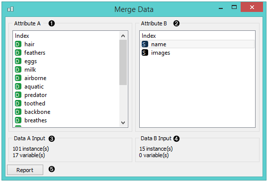
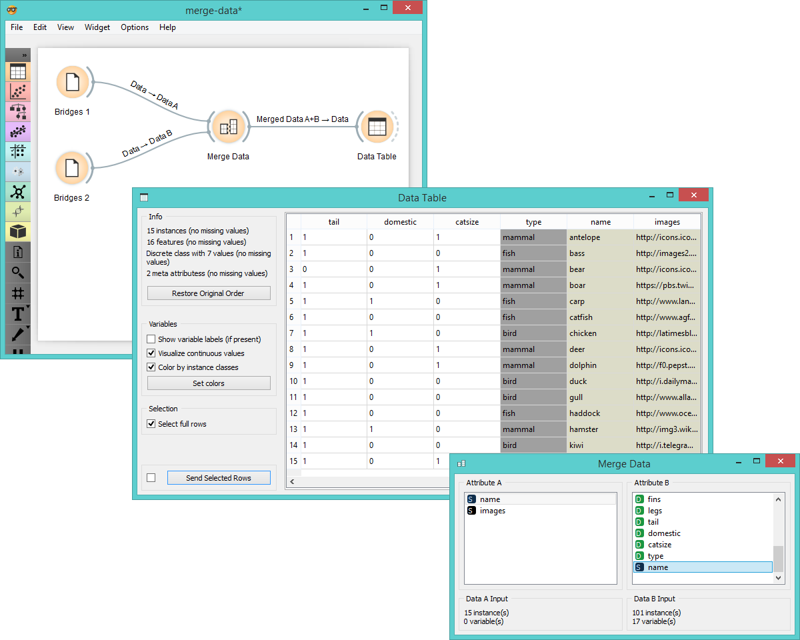
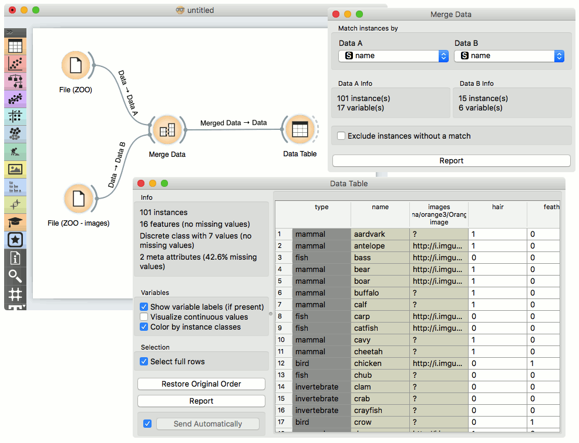
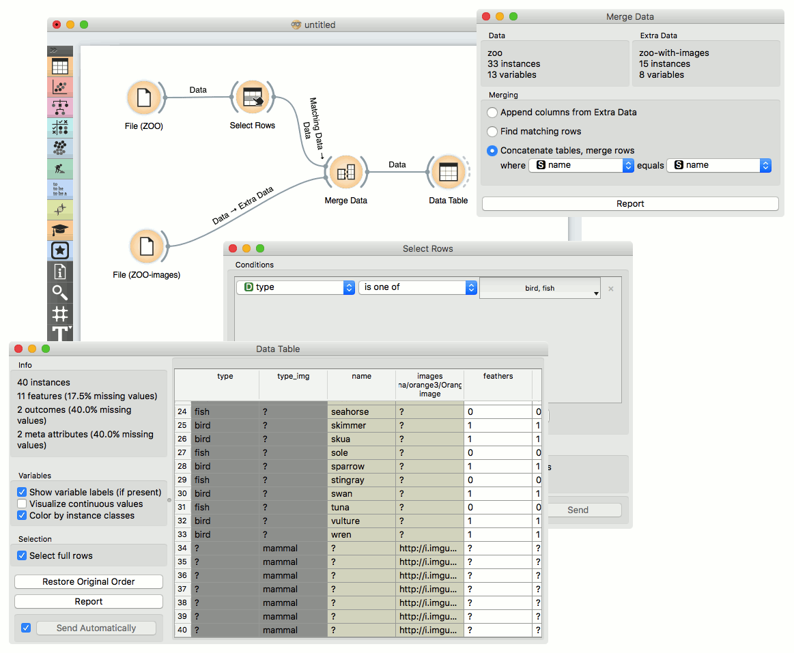

Merge Data
==========

Merges two data sets, based on values of selected attributes.

Signals
-------

**Inputs**:

-  **Data**

   Attribute-valued data set.

-  **Extra Data**

   Attribute-valued data set.

**Outputs**:

-  **Data**

   Instances from input data to which attributes from input extra data are
   added.

Description
-----------

The **Merge Data** widget is used to horizontally merge two data sets, based
on values of selected attributes. In the input, two data sets are
required, data and extra data. The widget allows selection of an attribute from each
domain, which will be used to perform the merging. The widget produces
one output. It corresponds to instances from the input data
to which attributes from input extra data are appended.

Merging is done by values of selected (merging) attributes. First,
the value of the merging attribute from Data is taken and instances from Extra
Data are searched for matching values. If more than a single instance from Extra
Data was to be found, the attribute is removed from available merging attributes.

1. Information on Data
2. Information on Extra Data
3. Merging type.
   **Append columns from Extra Data** outputs all instances from
   Data appended by matching instances from Extra Data. When no match is found,
   unknown values are appended.
   **Find matching rows** outputs similar as above,
   except hen no match is found, instances are excluded.
   **Concatenate tables, merge rows** outputs all instances from both inputs,
   even though the match may not be found. In that case unknown values are
   assigned.
4. List of comparable attributes from Data
5. List of comparable attributes from Extra Data
6. Produce a report.

Example
-------

Merging two data sets results in appending new attributes to the
original file, based on a selected common attribute. In the example
below, we wanted to merge the **zoo.tab** file containing only factual
data with :download:`zoo-with-images.tab <../data/zoo-with-images.tab>`
containing images. Both files share a common string attribute *names*. Now, we
create a workflow connecting the two files. The *zoo.tab* data is
connected to **Data** input of the **Merge Data** widget, and the
*zoo-with-images.tab* data to the **Extra Data** input. Outputs of the
**Merge Data** widget is then connected to the :doc:`Data Table <../data/datatable>` widget.
In the latter, the **Merged Data** channels are shown, where image attributes
are added to the original data.

The case where we want to include all instances in the output, even those
where no match by attribute *names* was found, is shown in the following workflow.

The third type of merging is shown in the next workflow. The output consist of
both inputs, with unknown values assigned where no match was found.

Hint
----

If the two data sets consist of equally-named attributes (other than
the ones used to perform the merging), Orange will check by default for
consistency of the values of these attributes and report an error in
case of non-matching values. In order to avoid the consistency checking,
make sure that new attributes are created for each data set: you may use the
'*Columns with the same name in different files represent different
variables*' option in the :doc:`File <../data/file>` widget for loading the data.
