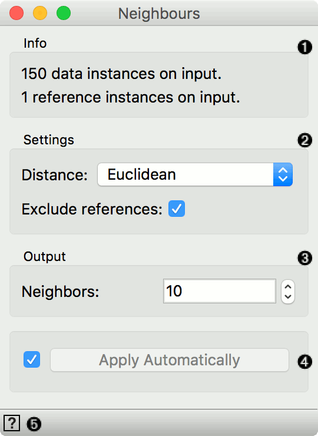
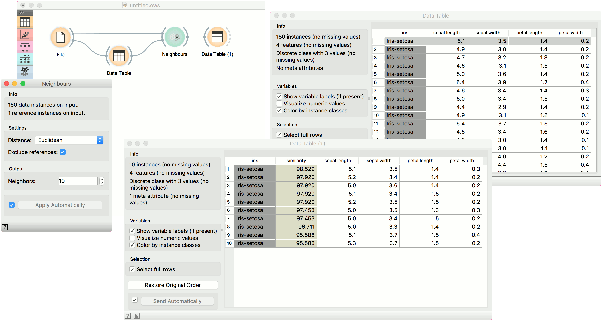
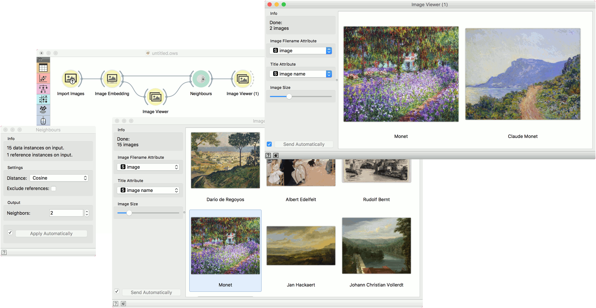

Neighbors
=========

Compute nearest neighbors in data according to reference.

**Inputs**

- Data: An input data set.
- Reference: A reference data instance for neighbor computation.

**Outputs**

- Neighbors: A data table of nearest neighbors according to reference.

The **Neighbors** widget computes nearest neighbors for a given reference and for a given distance measure.

1. Information on the input data.
2. Distance measure for computing neighbors. Supported measures are: Euclidean, Manhattan, Mahalanobis, Cosine, Jaccard, Spearman, absolute Spearman, Pearson, absolute Pearson. If *Exclude references* is ticked, data instances that are highly similar to the reference (distance < 1e-5), will be excluded.
3. Number of neighbors on the output.
4. Click *Apply* to commit the changes. To communicate changes automatically tick *Apply Automatically*.
5. Access widget help.

Examples
--------

In the first example, we used *iris* data and passed it to **Neighbors** and to [Data Table](../data/datatable.md). In **Data Table**, we selected an instance of iris, that will serve as our reference, meaning we wish to retrieve 10 closest examples to the select data instance. We connect **Data Table** to **Neighbors** as well.

We can observe the results of neighbor computation in **Data Table (1)**, where we can see 10 closest images to our selected iris flower.

Another example requires the installation of Image Analytics add-on. We loaded 15 paintings from famous painters with **Import Images** widget and passed them to **Image Embedding**, where we selected *Painters* embedder.

Then the procedure is the same as above. We passed embedded images to **Image Viewer** and selected a painting from Monet to serve as our reference image. We passed the image to **Neighbors**, where we set the distance measure to *cosine*, ticked off *Exclude reference* and set the neighbors to 2. This allows us to find the actual closest neighbor to a reference painting and observe them side by side in **Image Viewer (1)**.

