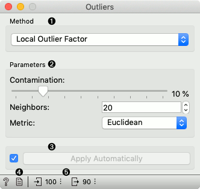
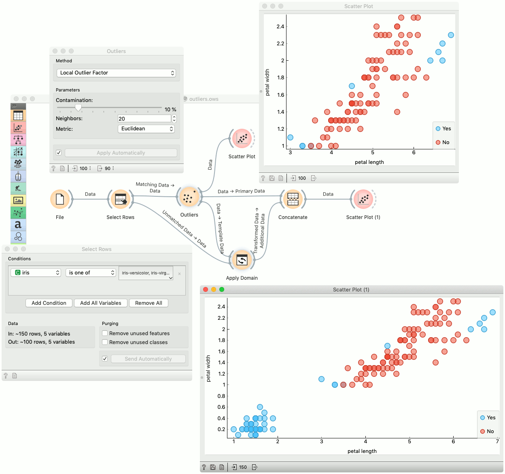

Outliers
========

Outlier detection widget.

**Inputs**

- Data: input dataset

**Outputs**

- Outliers: instances scored as outliers
- Inliers: instances not scored as outliers
- Data: input dataset appended *Outlier* variable

The **Outliers** widget applies one of the four methods for outlier detection. All methods apply classification to the dataset. *One-class SVM with non-linear kernels (RBF)* performs well with non-Gaussian distributions, while *Covariance estimator* works only for data with Gaussian distribution. One efficient way to perform outlier detection on moderately high dimensional datasets is to use the *Local Outlier Factor* algorithm. The algorithm computes a score reflecting the degree of abnormality of the observations. It measures the local density deviation of a given data point with respect to its neighbors. Another efficient way of performing outlier detection in high-dimensional datasets is to use random forests (*Isolation Forest*).

1. Method for outlier detection:
   - [One Class SVM](http://scikit-learn.org/stable/modules/generated/sklearn.svm.OneClassSVM.html)
   - [Covariance Estimator](http://scikit-learn.org/stable/modules/generated/sklearn.covariance.EllipticEnvelope.html)
   - [Local Outlier Factor](http://scikit-learn.org/stable/modules/generated/sklearn.neighbors.LocalOutlierFactor.html)
   - [Isolation Forest](http://scikit-learn.org/stable/modules/generated/sklearn.ensemble.IsolationForest.html)
2. Set parameters for the method:
   - **One class SVM with non-linear kernel (RBF)**: classifies data as similar or different from the core class:
      - *Nu* is a parameter for the upper bound on the fraction of training errors and a lower bound of the fraction of support vectors
      - *Kernel coefficient* is a gamma parameter, which specifies how much influence a single data instance has
    - **Covariance estimator**: fits ellipsis to central points with Mahalanobis distance metric:
      - *Contamination* is the proportion of outliers in the dataset
      - *Support fraction* specifies the proportion of points included in the estimate
   - **Local Outlier Factor**: obtains local density from the k-nearest neighbors:
      - *Contamination* is the proportion of outliers in the dataset
      - *Neighbors* represents number of neighbors
      - *Metric* is the distance measure
   - **Isolation Forest**: isolates observations by randomly selecting a feature and then randomly selecting a split value between the maximum and minimum values of the selected feature:
     - *Contamination* is the proportion of outliers in the dataset
     - *Replicabe training* fixes random seed
3. If *Apply automatically* is ticked, changes will be propagated automatically. Alternatively, click *Apply*.
4. Produce a report.
5. Number of instances on the input, followed by number of instances scored as inliers.

Example
-------

Below is an example of how to use this widget. We used subset (*versicolor* and *virginica* instances) of the *Iris* dataset to detect the outliers. We chose the *Local Outlier Factor* method, with *Euclidean* distance. Then we observed the annotated instances in the [Scatter Plot](../visualize/scatterplot.md) widget. In the next step we used the *setosa* instances to demonstrate novelty detection using [Apply Domain](../data/applydomain.md) widget. After concatenating both outputs we examined the outliers in the *Scatter Plot (1)*.

