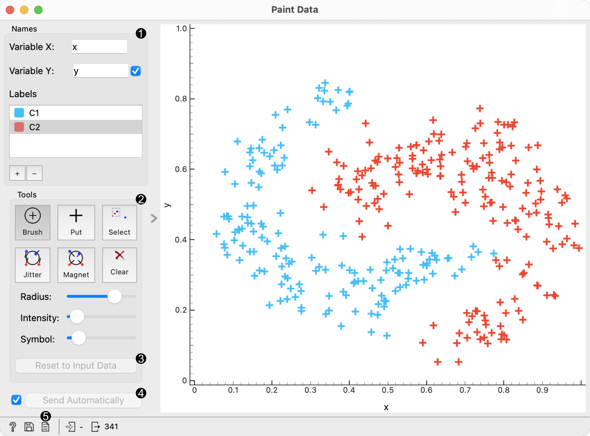
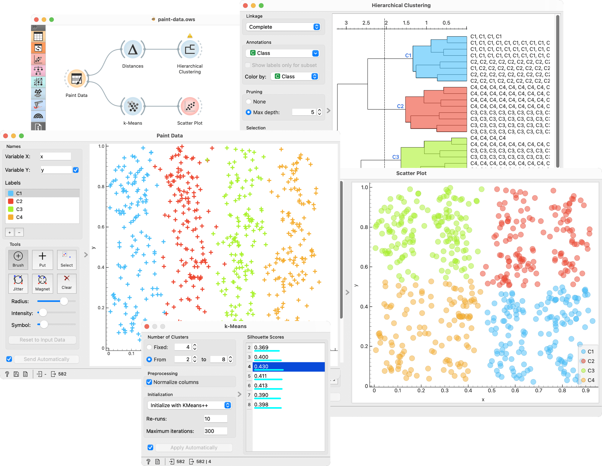

Paint Data
==========

Paints data on a 2D plane. You can place individual data points or
use a brush to paint larger data sets.

Signals
-------

**Inputs**

-  (None)

**Outputs**

-  **Data**

   Attribute-valued data set created in the widget

Description
-----------

The widget supports the creation of a new data set by visually placing
data points on a two-dimension plane. Data points can be placed on the
plane individually (*Put*) or in a larger number by brushing (*Brush*).
Data points can belong to classes if the data is intended to be used in
supervised learning.

1. Name the axes and select a class to paint data instances. You can
   add or remove classes. Use only one class to create classless,
   unsupervised data sets.
2. Drawing tools. Paint data points with *Brush* (multiple data
   instances) or *Put* (individual data instance). Select data points
   with *Select* and remove them with the Delete/Backspace key. Reposition
   data points with `Jitter <https://en.wikipedia.org/wiki/Jitter>`_
   (spread) and *Magnet* (focus). Use *Zoom* and scroll to zoom in or
   out. Below, set the radius and intensity for Brush, Put, Jitter and
   Magnet tools.
3. Reset to Input Data. 
4. *Save Image* saves the image to your computer in a .svg or .png
   format.
5. Produce a report. 
6. Tick the box on the left to automatically commit changes to other
   widgets. Alternatively, press *Send* to apply them.

Example
-------

In the example below, we have painted a data set with 4 classes. Such data set
is great for demonstrating k-means and hierarchical clustering methods.
In the screenshot, we see that :doc:`k-means <../unsupervised/kmeansclustering>`, overall, recognizes 
clusters better than :doc:`hierarchical clustering <../unsupervised/hierarchicalclustering>`. 
It returns a score rank, where the best score (the one with the highest value) means the most likely number
of clusters. Hierarchical clustering, however, doesn’t group the right
classes together. This is a great tool for learning and exploring
statistical concepts.

