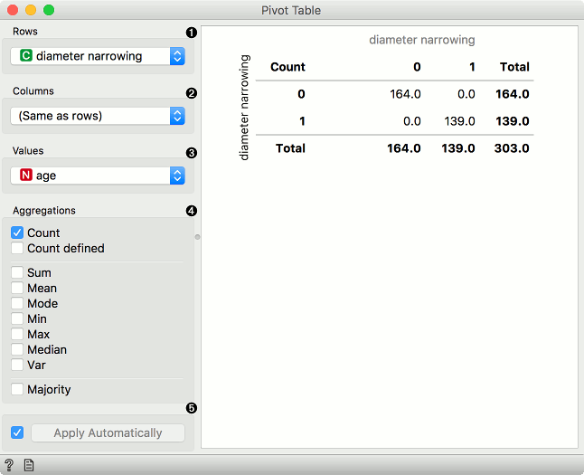
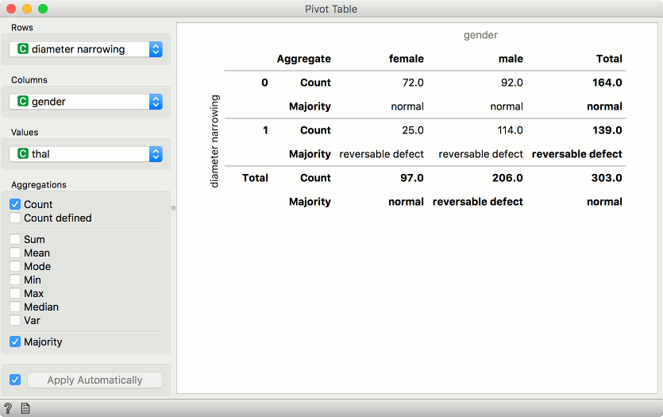
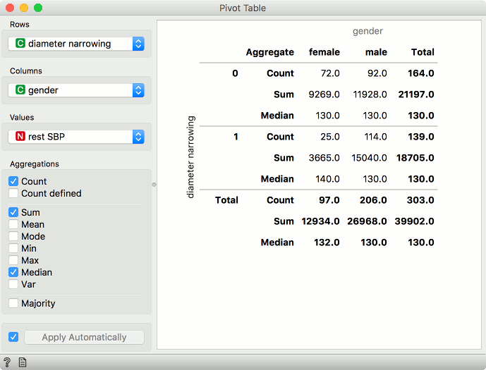
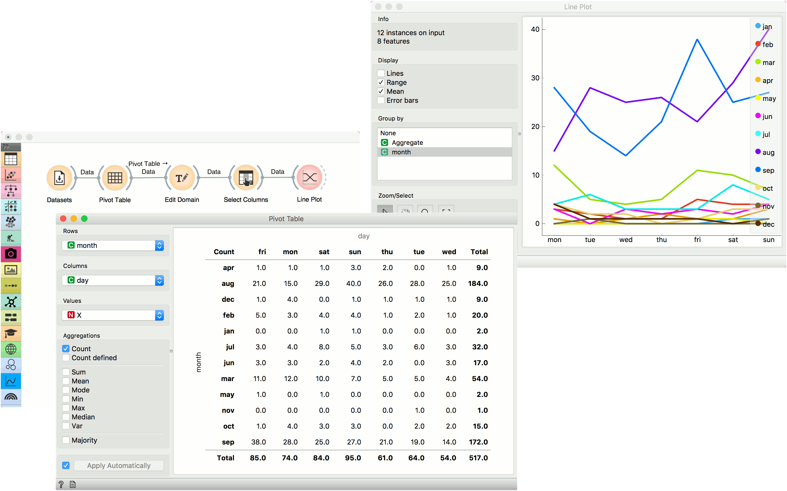

Pivot Table
===========

Reshape data table based on column values.

**Inputs**

- Data: input data set

**Outputs**

- Pivot Table: contingency matrix as shown in the widget
- Filtered Data: subset selected from the plot
- Grouped Data: aggregates over groups defined by row values

**Pivot Table** summarizes the data of a more extensive table into a table of statistics. The statistics can include sums, averages, counts, etc. The widget also allows selecting a subset from the table and grouping by row values, which have to be a discrete variable. Data with only numeric variables cannot be displayed in the table.

1. Discrete or numeric variable used for row values. Numeric variables are considered as integers.
2. Discrete variable used for column values. Variable values will appear as columns in the table.
3. Values used for aggregation. Aggregated values will appear as cells in the table.
4. Aggregation methods:
   - For any variable type:
      - *Count*: number of instances with the given row and column value.
      - *Count defined*: number of instances where the aggregation value is defined.
   - For numeric variables:
      - *Sum*: sum of values.
      - *Mean*: average of values.
      - *Mode*: most frequent value of the subset.
      - *Min*: smallest value.
      - *Max*: highest value.
      - *Median*: middle value.
      - *Var*: variance of the subset.
   - For discrete variables:
      - *Majority*: most frequent value of the subset.
5. Tick the box on the left to automatically output any changes. Alternatively, press *Apply* .

Discrete variables
------------------

Example of a pivot table with only discrete variables selected. We are using *heart-disease* data set for this example. Rows correspond to values of *diameter narrowing* variable. Our columns are values of *gender*, namely female and male. We are using *thal* as values in our cells.

We have selected *Count* and *Majority* as aggregation methods. In the pivot table, we can see the number of instances that do not have diameter narrowing and are female. There are 72 such patients. Concurrently, there are 92 male patients that don't have diameter narrowing. Thal values don't have any effect here, we are just counting occurrences in the data.

The second row shows majority. This means most female patients that don't have diameter narrowing have normal thal results. Conversely, female patients that have diameter narrowing most often have reversable defect.

Numeric variables
-----------------

Example of a pivot table with numeric variables. We are using *heart-disease* data set for this example. Rows correspond to values of *diameter narrowing* variable. Our columns are values of *gender*, namely female and male. We are using *rest SBP* as values in our cells.

We have selected *Count*, *Sum* and *Median* as aggregation methods. Under *Count*, we see there are 72 female patients that don't have diameter narrowing, same as before for discrete values. What is different are the sum and median aggregations. We see that the sum of resting systolic blood pressure for female patients that don't have diameter narrowing is 9269 and the median value is 130.

Example
-------

We are using *Forest Fires* for this example. The data is loaded in the [Datasets](../data/datasets.md) widget and passed to **Pivot Table**. *Forest Fires* datasets reports forest fires by the month and day they happened. We can aggregate all occurrences of forest fires by selecting *Count* as aggregation method and using *month* as row and *day* as column values. Since we are using *Count*, *Values* variable will have no effect.

We can plot the counts in [Line Plot](../visualize/lineplot.md). But first, let us organize our data a bit. With [Edit Domain](../data/editdomain.md), we will reorder rows values so that months will appear in the correct order, namely from January to December. To do the same for columns, we will use [Select Columns](../data/selectcolumns.md) and reorder day to go from Monday to Sunday.

Finally, our data is ready. Let us pass it to **Line Plot**. We can see that forest fires are most common in August and September, while their frequency is higher during the weekend than during weekdays.

