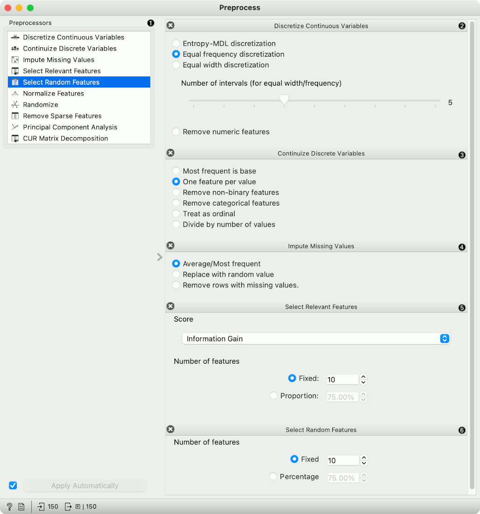
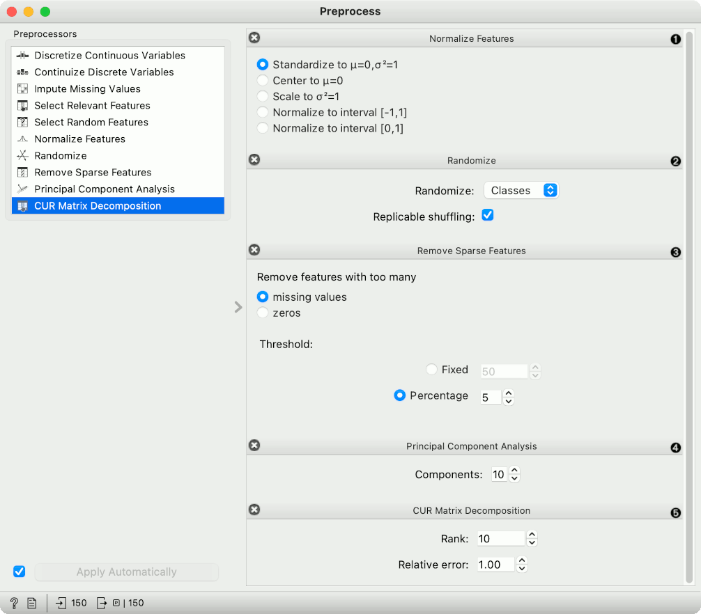
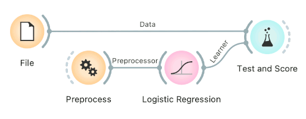
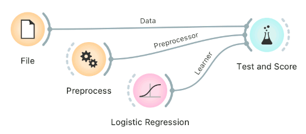
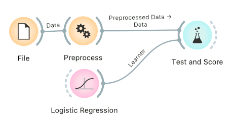
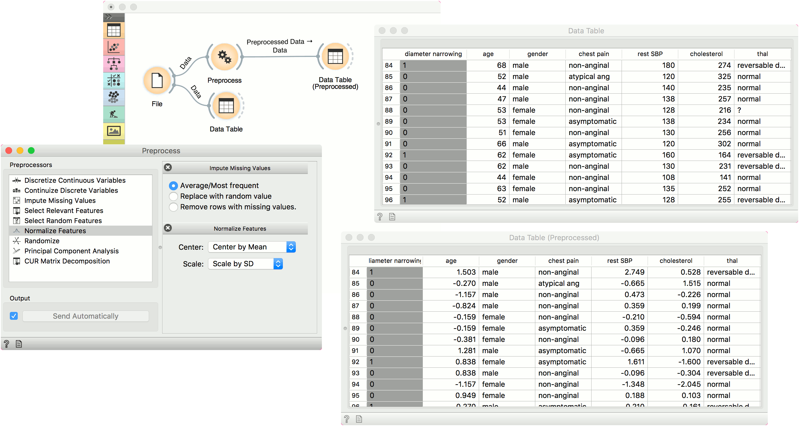

Preprocess
==========

Preprocesses data with selected methods.

**Inputs**

- Data: input dataset

**Outputs**

- Preprocessor: preprocessing method
- Preprocessed Data: data preprocessed with selected methods

Preprocessing is crucial for achieving better-quality analysis results. The **Preprocess** widget offers several preprocessing methods that can be combined in a single preprocessing pipeline. Some methods are available as separate widgets, which offer advanced techniques and greater parameter tuning.

1. List of preprocessors. Double click the preprocessors you wish to use and shuffle their order by dragging them up or down. You can also add preprocessors by dragging them from the left menu to the right.
2. Preprocessing pipeline.
3. When the box is ticked (*Send Automatically*), the widget will communicate changes automatically. Alternatively, click *Send*.

Preprocessors
-------------

1. List of preprocessors.
2. Discretization of continuous values:
   - [Entropy-MDL discretization](http://sci2s.ugr.es/keel/pdf/algorithm/congreso/fayyad1993.pdf) by Fayyad and Irani that uses [expected information](http://kevinmeurer.com/a-simple-guide-to-entropy-based-discretization/) to determine bins.
   - *Equal frequency discretization* splits by frequency (same number of instances in each bin.
   - *Equal width discretization* creates bins of equal width (span of each bin is the same).
   - *Remove numeric features* altogether.
3. Continuization of discrete values:
   - *Most frequent as base* treats the most frequent discrete value as 0 and others as 1. The discrete attributes with more than 2 values, the most frequent will be considered as a base and contrasted with remaining values in corresponding columns.
   - *One feature per value* creates columns for each value, place 1 where an instance has that value and 0 where it doesn't. Essentially [One Hot Encoding](http://scikit-learn.org/stable/modules/generated/sklearn.preprocessing.OneHotEncoder.html).
   - *Remove non-binary features* retains only categorical features that have values of either 0 or 1 and transforms them into continuous.
   - *Remove categorical features* removes categorical features altogether.
   - *Treat as ordinal* takes discrete values and treats them as numbers. If discrete values are categories, each category will be assigned a number as they appear in the data.
   - *Divide by number of values* is similar to treat as ordinal, but the final values will be divided by the total number of values and hence the range of the new continuous variable will be [0, 1].
4. Impute missing values:
   - *Average/Most frequent* replaces missing values (NaN) with the average (for continuous) or most frequent (for discrete) value.
   - *Replace with random value* replaces missing values with random ones within the range of each variable.
   - *Remove rows with missing values*.
5. Select relevant features:
   - Similar to [Rank](../data/rank.md), this preprocessor outputs only the most informative features. Score can be determined by information gain, [gain ratio](https://en.wikipedia.org/wiki/Information_gain_ratio), [gini index](https://en.wikipedia.org/wiki/Gini_coefficient), [ReliefF](https://en.wikipedia.org/wiki/Relief_(feature_selection)), [fast correlation based filter](https://www.aaai.org/Papers/ICML/2003/ICML03-111.pdf), [ANOVA](https://en.wikipedia.org/wiki/One-way_analysis_of_variance), [Chi2](https://en.wikipedia.org/wiki/Chi-squared_distribution), [RReliefF](http://lkm.fri.uni-lj.si/rmarko/papers/robnik03-mlj.pdf), and [Univariate Linear Regression](http://scikit-learn.org/stable/modules/feature_selection.html#feature-selection-using-selectfrommodel).
   - *Strategy* refers to how many variables should be on the output. *Fixed* returns a fixed number of top scored variables, while *Percentile* return the selected top percent of the features.
6. *Select random features* outputs either a fixed number of features from the original data or a percentage. This is mainly used for advanced testing and educational purposes.

1. Normalize adjusts values to a common scale. Center values by mean or median or omit centering altogether. Similar for scaling, one can scale by SD (standard deviation), by span or not at all.
2. Randomize instances. Randomize classes shuffles class values and destroys connection between instances and class. Similarly, one can randomize features or meta data. If replicable shuffling is on, randomization results can be shared and repeated with a saved workflow. This is mainly used for advanced testing and educational purposes.
3. *Remove sparse features* retains features that have more than a number/percentage of non-zero/missing values. The rest are discarded.
4. Principal component analysis outputs results of a PCA transformation. Similar to the [PCA](../unsupervised/PCA.md) widget.
5. [CUR matrix decomposition](https://en.wikipedia.org/wiki/CUR_matrix_approximation) is a dimensionality reduction method, similar to SVD.

Preprocessing for predictive modeling
--------------------------------------

When building predictive models, one has to be careful about how to do preprocessing. There are two possible ways to do it in Orange, each slightly different:

1. Connect **Preprocess** to the learner. This will override the default preprocessing pipeline for the learner and apply only custom preprocessing pipeline (default preprocessing steps are described in each learner's documentation).

   

2. Connect **Preprocess** to Test and Score. This will apply the preprocessors to each batch within cross-validation. Then the learner's preprocessors will be applied to the preprocessed subset.

   

Finally, there's a wrong way to do it. Connecting **Preprocess** directly to the original data and outputting preprocessed data set will likely overfit the model. Don't do it.

   

Examples
--------

In the first example, we have used the *heart_disease.tab* dataset available in the dropdown menu of the [File](../data/file.md) widget. then we used **Preprocess** to impute missing values and normalize features. We can observe the changes in the [Data Table](../data/datatable.md) and compare it to the non-processed data.

In the second example, we show how to use **Preprocess** for predictive modeling.

This time we are using the *heart_disease.tab* data from the [File](../data/file.md) widget. You can access the data in the dropdown menu. This is a dataset with 303 patients that came to the doctor suffering from a chest pain. After the tests were done, some patients were found to have diameter narrowing and others did not (this is our class variable).

Some values are missing in our data set, so we would like to impute missing values before evaluating the model. We do this by passing a preprocessor directly to [Test and Score](../evaluate/testandscore.md). In **Preprocess**, we set the correct preprocessing pipeline (in our example only a single preprocessor with *Impute missing values*), then connect it to the Preprocessor input of Test and Score.

We also pass the data and the learner (in this case, a [Logistic Regression](../model/logisticregression.md)). This is the correct way to pass a preprocessor to cross-validation as each fold will independently get preprocessed in the training phase. This is particularly important for feature selection.

