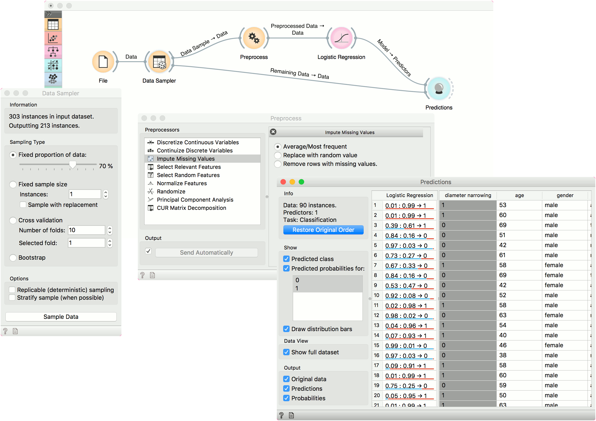

Preprocess
==========

Preprocesses data with selected methods.

**Inputs**

- Data: input dataset

**Outputs**

- Preprocessor: preprocessing method
- Preprocessed Data: data preprocessed with selected methods

Preprocessing is crucial for achieving better-quality analysis results. The **Preprocess** widget offers several preprocessing methods that can be combined in a single preprocessing pipeline. Some methods are available as separate widgets, which offer advanced techniques and greater parameter tuning.

1. List of preprocessors. Double click the preprocessors you wish to use and shuffle their order by dragging them up or down. You can also add preprocessors by dragging them from the left menu to the right.
2. Preprocessing pipeline.
3. When the box is ticked (*Send Automatically*), the widget will communicate changes automatically. Alternatively, click *Send*.

Preprocessors
-------------

1. Discretization of continuous values:
   - [Entropy-MDL discretization](http://sci2s.ugr.es/keel/pdf/algorithm/congreso/fayyad1993.pdf) by Fayyad and Irani that uses [expected information](http://kevinmeurer.com/a-simple-guide-to-entropy-based-discretization/) to determine bins.
   - *Equal frequency discretization* splits by frequency (same number of instances in each bin.
   - *Equal width discretization* creates bins of equal width (span of each bin is the same).
   - *Remove numeric features* altogether.
2. Continuization of discrete values:
   - *Most frequent as base* treats the most frequent discrete value as 0 and others as 1. The discrete attributes with more than 2 values, the most frequent will be considered as a base and contrasted with remaining values in corresponding columns.
   - *One feature per value* creates columns for each value, place 1 where an instance has that value and 0 where it doesn't. Essentially [One Hot Encoding](http://scikit-learn.org/stable/modules/generated/sklearn.preprocessing.OneHotEncoder.html).
   - *Remove non-binary features* retains only categorical features that have values of either 0 or 1 and transforms them into continuous.
   - *Remove categorical features* removes categorical features altogether.
   - *Treat as ordinal* takes discrete values and treats them as numbers. If discrete values are categories, each category will be assigned a number as they appear in the data.
   - *Divide by number of values* is similar to treat as ordinal, but the final values will be divided by the total number of values and hence the range of the new continuous variable will be [0, 1].
3. Impute missing values:
   - *Average/Most frequent* replaces missing values (NaN) with the average (for continuous) or most frequent (for discrete) value.
   - *Replace with random value* replaces missing values with random ones within the range of each variable.
   - *Remove rows with missing values*.
4. Select relevant features:
   - Similar to [Rank](../data/rank.md), this preprocessor outputs only the most informative features. Score can be determined by information gain, [gain ratio](https://en.wikipedia.org/wiki/Information_gain_ratio), [gini index](https://en.wikipedia.org/wiki/Gini_coefficient), [ReliefF](https://en.wikipedia.org/wiki/Relief_(feature_selection)), [fast correlation based filter](https://www.aaai.org/Papers/ICML/2003/ICML03-111.pdf), [ANOVA](https://en.wikipedia.org/wiki/One-way_analysis_of_variance), [Chi2](https://en.wikipedia.org/wiki/Chi-squared_distribution), [RReliefF](http://lkm.fri.uni-lj.si/rmarko/papers/robnik03-mlj.pdf), and [Univariate Linear Regression](http://scikit-learn.org/stable/modules/feature_selection.html#feature-selection-using-selectfrommodel).
   - *Strategy* refers to how many variables should be on the output. *Fixed* returns a fixed number of top scored variables, while *Percentile* return the selected top percent of the features.

1. *Select random features* outputs either a fixed number of features from the original data or a percentage. This is mainly used for advanced testing and educational purposes.
2. Normalize adjusts values to a common scale. Center values by mean or median or omit centering altogether. Similar for scaling, one can scale by SD (standard deviation), by span or not at all.
3. Randomize instances. Randomize classes shuffles class values and destroys connection between instances and class. Similarly, one can randomize features or meta data. If replicable shuffling is on, randomization results can be shared and repeated with a saved workflow. This is mainly used for advanced testing and educational purposes.
4. Principal component analysis outputs results of a PCA transformation. Similar to the [PCA](../unsupervised/PCA.md) widget.
5. [CUR matrix decomposition](https://en.wikipedia.org/wiki/CUR_matrix_approximation) is a dimensionality reduction method, similar to SVD.

Examples
--------

In the first example, we have used the *heart_disease.tab* dataset available in the dropdown menu of the [File](../data/file.md) widget. then we used **Preprocess** to impute missing values and normalize features. We can observe the changes in the [Data Table](../data/datatable.md) and compare it to the non-processed data.

In the second example, we show how to use **Preprocess** for predictive modeling.

This time we are using the *heart_disease.tab* data from the [File](../data/file.md) widget. You can access the data through the dropdown menu. This is a dataset with 303 patients that came to the doctor suffering from a chest pain. After the tests were done, some patients were found to have diameter narrowing and others did not (this is our class variable).

The heart disease data have some missing values and we wish to account for that. First, we will split the data set into train and test data with [Data Sampler](../data/datasampler.md).

Then we will send the *Data Sample* into [Preprocess](../data/preprocess.md). We will use *Impute Missing Values*, but you can try any combination of preprocessors on your data. We will send preprocessed data to [Logistic Regression](../model/logisticregression.md) and the constructed model to **Predictions**.

Finally, **Predictions** also needs the data to predict on. We will use the output of [Data Sampler](../data/datasampler.md) for prediction, but this time not the *Data Sample*, but the *Remaining Data*, this is the data that wasn't used for training the model.

Notice how we send the remaining data directly to **Predictions** without applying any preprocessing. This is because Orange handles preprocessing on new data internally to prevent any errors in the model construction. The exact same preprocessor that was used on the training data will be used for predictions. The same process applies to [Test & Score](../evaluation/testandscore.md).

