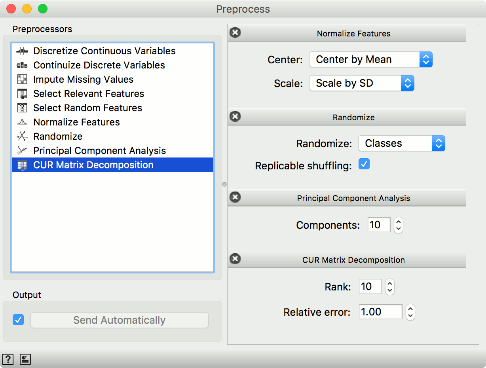
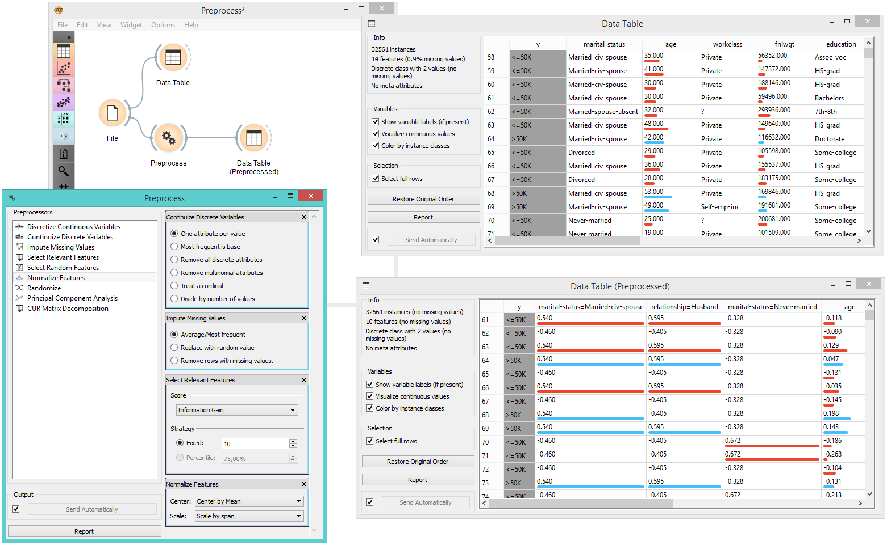

Preprocess
==========

Preprocesses data with selected methods.

Inputs
    Data
        input dataset

Outputs
    Preprocessor
        preprocessing method
    Preprocessed Data
        data preprocessed with selected methods

Preprocessing is crucial for achieving better-quality analysis results.
The **Preprocess** widget offers five preprocessing methods to improve
data quality. In this widget, you can immediately discretize continuous
values or continuize discrete ones, impute missing values, select
relevant features or center and scale them. Basically, this widget
combines four separate widgets for simpler processing.

.. figure:: images/Preprocess-stamped.png

1. List of preprocessors. You drag the preprocessors you wish to use to the right side of the widget.
2. When the box is ticked (*Send Automatically*), the widget will
   communicate changes automatically. Alternatively, click *Send*.
3. Access help and produce a report.

Preprocessors
-------------

- Discretization of continuous values:

   - `Entropy-MDL discretization <http://sci2s.ugr.es/keel/pdf/algorithm/congreso/fayyad1993.pdf>`_ by Fayyad and Irani that uses `expected information <http://kevinmeurer.com/a-simple-guide-to-entropy-based-discretization/>`_ to determine bins
   - Equal frequency discretization splits by frequency (same number of instances in each bin.
   - Equal width discretization creates bins of equal width (span of each bin is the same).
   - Remove numeric/continuous features altogether.

- Continuization of discrete values:

   - Most frequent is base treats the most frequent discrete value as 0 and others as 1. The discrete attributes with more than 2 values, the most frequent will be considered as a base and contrasted with remaining values in corresponding columns.
   - One feature per value creates columns for each value, place 1 where an instance has that value and 0 where it doesn't. Essentially `One Hot Encoding <http://scikit-learn.org/stable/modules/generated/sklearn.preprocessing.OneHotEncoder.html>`_.
   - Remove non-binary features retains only categorical features that have values of either 0 or 1 and transforms them into continuous.
   - Remove categorical features removes categorical features altogether.
   - Treat as ordinal takes discrete values and treats them as numbers. If discrete values are categories, each category will be asssigned a number as they appear in the data.
   - Divide by number of values is similar to treat as ordinal, but the final values will be divided by the total number of values and hence the range of the new continuous variable will be [0, 1].

- Impute missing values:

   - Replace missing values (NaN) with the average (for continuous) or most frequent (for discrete) value.
   - Replace missing values with random values within the range of the existing value.
   - Remove rows with missing values.

- Select relevant features:

   - Similar to Rank, this preprocessor outputs only the most informative features. Score can be determined by information gain, `gain ratio <https://en.wikipedia.org/wiki/Information_gain_ratio>`_, `gini index <https://en.wikipedia.org/wiki/Gini_coefficient>`_, `ReliefF <https://en.wikipedia.org/wiki/Relief_(feature_selection)>`_, `fast correlation based filter <https://www.aaai.org/Papers/ICML/2003/ICML03-111.pdf>`_, `ANOVA <https://en.wikipedia.org/wiki/One-way_analysis_of_variance>`_, `Chi2 <https://en.wikipedia.org/wiki/Chi-squared_distribution>`_, `RReliefF <http://lkm.fri.uni-lj.si/rmarko/papers/robnik03-mlj.pdf>`_, and `Univariate Linear Regression <http://scikit-learn.org/stable/modules/feature_selection.html#feature-selection-using-selectfrommodel>`_.

- Select random features outputs either a fixed number of features from the original data or a percentage.

- Normalize adjusts values to a common scale. Center values by mean or median or omit centering altogether. Similar for scaling, one can scale by SD (standard deviation), by span or not at all.

- Randomize instances. Randomize classes shuffles class values and destroys connection between instances and class. Similarly, one can randomize features or meta data. If replicable shuffling is on, randomization results can be shared and repeated with a saved workflow.

- Principal component analysis outputs results of a PCA transformation. Similar to the :doc:`PCA <../unsupervised/PCA>` widget.

- `CUR matrix decomposition <https://en.wikipedia.org/wiki/CUR_matrix_approximation>`_ is another dimensionality reduction method, similar to SVD.

Example
-------

In the example below, we have used the *adult* dataset and preprocessed the data. We continuized discrete values (age, education and marital status...) as *one feature per value*, we imputed missing values (replacing ? with average values), selected 10 most relevant attributes by *Information gain*, centered them by mean and scaled by span with normalize features. We can observe the changes in the :doc:`Data Table <../data/datatable>` and compare it to the non-processed data.

