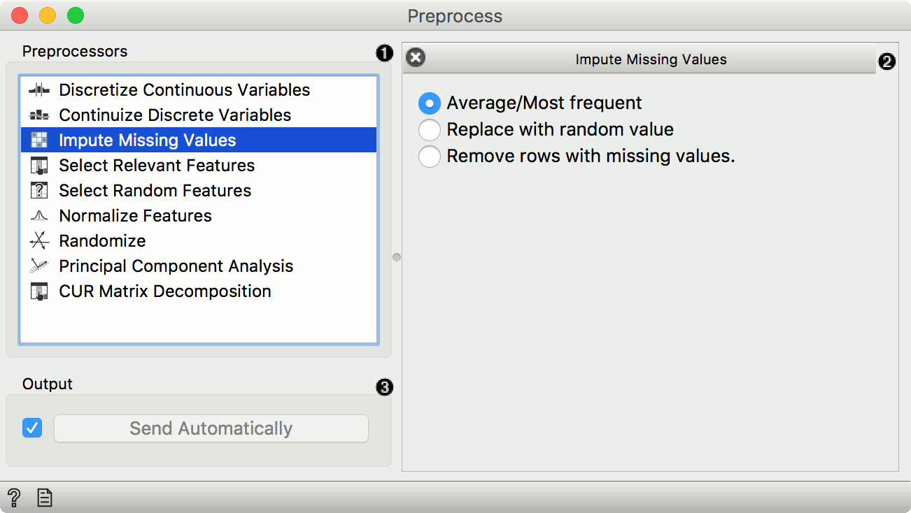

Preprocess
==========

Preprocesses data with selected methods.

Signals
-------

**Inputs**:

-  **Data**

   A data set.

**Outputs**:

-  **Preprocessor**

   A preprocessing method.

-  **Preprocessed Data**

   Data preprocessed with selected methods.

Description
-----------

Preprocessing is crucial for achieving better-quality analysis results.
The **Preprocess** widget offers five preprocessing methods to improve
data quality. In this widget, you can immediately discretize continuous
values or continuize discrete ones, impute missing values, select
relevant features or center and scale them. Basically, this widget
combines four separate widgets for simpler processing.

1. List of preprocessors. You drag the preprocessors you wish to use to the right side of the widget. 
2. Discretization of continuous values
3. Continuization of discrete values
4. Impute missing values or remove them.
5. Select the most relevant features by information gain, gain ratio,
   Gini index.
6. Select random features
7. Normalize features
8. Randomize
9. When the box is ticked (*Send Automatically*), the widget will
   communicate changes automatically. Alternatively, click *Send*.
10. Produce a report. 

Example
-------

In the example below, we have used the *adult* data set and preprocessed the
data. We continuized discrete values (age, education and marital
status...) as *one attribute per value*, we imputed missing values
(replacing ? with average values), selected 10 most relevant attributes
by *Information gain*, centered them by mean and scaled by span. We
can observe the changes in the :doc:`Data Table <../data/datatable>` and compare it to the
non-processed data.

.. figure:: images/Preprocess-Example.png
