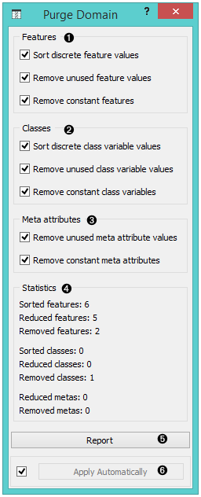
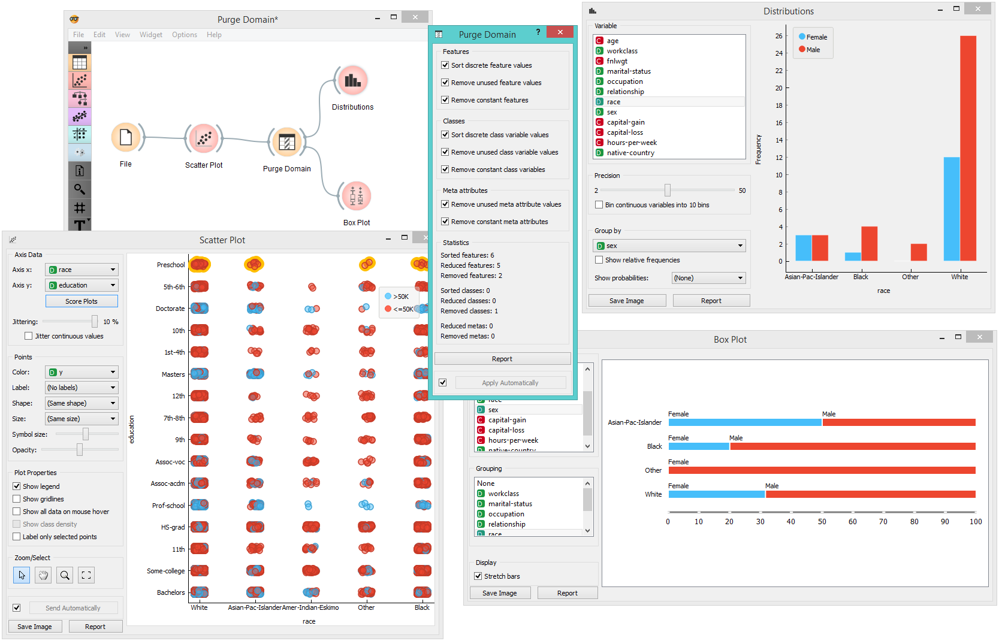

Purge Domain
============

Removes unused attribute values and useless attributes, sorts the remaining values.

Signals
-------

**Inputs**:

- **Data**

  A data set.

**Outputs**:

- **Data**

  Filtered data set

Description
-----------

Definitions of nominal attributes sometimes contain values which don’t
appear in the data. Even if this does not happen in the original data,
filtering the data, selecting examplary subsets and alike can remove
all examples for which the attribute has some particular value. Such
values clutter data presentation, especially various visualizations, and
should be removed.

After purging an attribute, it may become single-valued or, in extreme
case, have no values at all (if the value of this attribute was
undefined for all examples). In such cases, the attribute can be
removed.

A different issue is the order of attribute values: if the data is read
from a file in a format where values are not declared in advance,
they are sorted “in order of appearance”. Sometimes we would prefer to
have them sorted alphabetically.

1. Purge attributes
2. Purge classes
3. Information on the filtering process
4. If *Send automatically* is checked, the widget will output data at each
change of widget settings.

Such purification is done by widget **Purge Domain**. Ordinary attributes
and class attributes are treated separately. For each, we can decide if
we want the values sorted or not. Next, we may allow the widget to
remove attributes with less than two values or remove the class
attribute if there are less than two classes. Finally, we can instruct
the widget to check which values of attributes actually appear in the
data and remove the unused values. The widget cannot remove values if it
is not allowed to remove the attributes, since having
attributes without values makes no sense.

The new, reduced attributes get a prefix “R”, which distinguishes them
from the original ones. Values of new attributes can be computed
from the old ones, but not the opposite. This means that if you
construct a classifier from the new attributes, you can use it to
classify the examples described by the original attributes. But not the
opposite: constructing the classifier from old attributes and using it
on examples described by the reduced ones won’t work. Fortunately, the
latter is seldom the case. In a typical setup, one would explore the
data, visualize it, filter it, purify it… and then test the final model
on the original data.

Example
-------

**Purge Domain** would typically appear after data filtering, for instance
when selecting a subset of visualized examples.

In the above schema we play with the *adult.tab* data set: we visualize it and
select a portion of the data which contains only four out of the five original classes.
To get rid of the empty class, we put the data
through **Purge Domain** before going on to the **Box Plot**
widget. The latter shows only the four classes which are in the **Purge Data** output. To
see the effect of data purification, uncheck *Remove unused class values*
and observe the effect this has on **Box Plot**.

