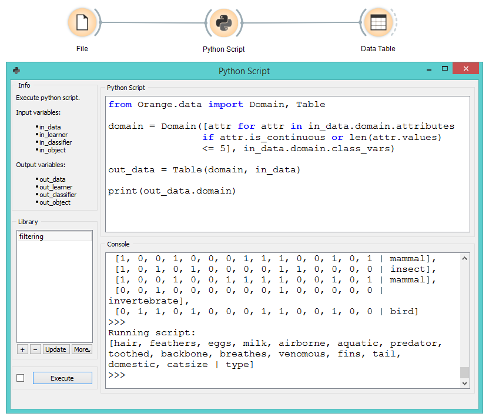
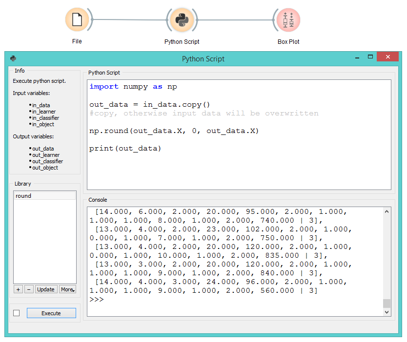
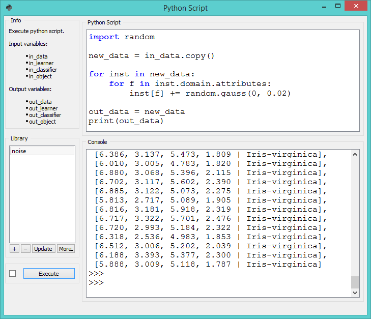
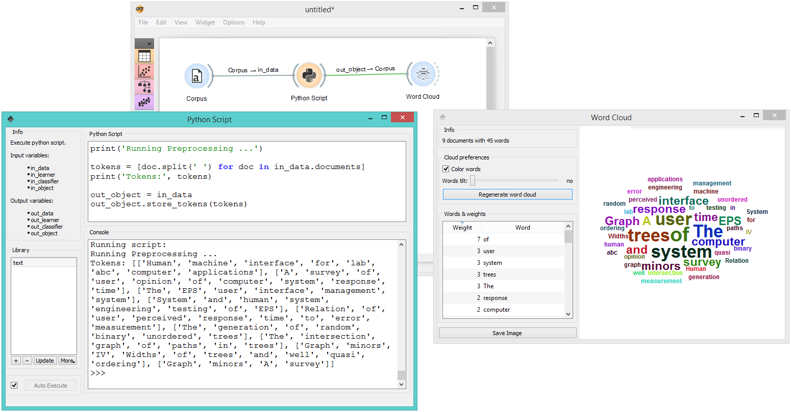

Python Script
=============

Extends functionalities through Python scripting.

Inputs
    Data (Orange.data.Table)
        input dataset bound to ``in_data`` variable
    Learner (Orange.classification.Learner)
        input learner bound to ``in_learner`` variable
    Classifier (Orange.classification.Learner)
        input classifier bound to ``in_classifier`` variable
    Object
        input python object bound to ``in_object`` variable

Outputs
    Data (Orange.data.Table)
        dataset retrieved from ``out_data`` variable
    Learner (Orange.classification.Learner)
        learner retrieved from ``out_learner`` variable
    Classifier (Orange.classification.Learner)
        classifier retrieved from ``out_classifier`` variable
    Object
        python object retrieved from ``out_object`` variable

**Python Script** widget can be used to run a python script in the
input, when a suitable functionality is not implemented in an existing
widget. The script has ``in_data``, ``in_distance``, ``in_learner``,
``in_classifier`` and ``in_object`` variables (from input signals) in
its local namespace. If a signal is not connected or it did not yet
receive any data, those variables contain ``None``.

After the script is executed, ``out_data``, ``out_distance``, …
variables from the script’s local namespace are extracted and used as
outputs of the widget. The widget can be further connected to other
widgets for visualizing the output.

For instance the following script would simply pass on all signals it
receives:

::

    out_data = in_data
    out_distance = in_distance
    out_learner = in_learner
    out_classifier = in_classifier
    out_object = in_object

.. note::

    You should not modify the input objects in place.

.. figure:: images/PythonScript-stamped.png

1. Info box contains names of basic operators for Orange Python script.
2. The *Library* control can be used to manage multiple scripts.
   Pressing "+" will add a new entry and open it in the *Python script*
   editor. When the script is modified, its entry in the *Library* will
   change to indicate it has unsaved changes. Pressing *Update* will
   save the script (keyboard shortcut ctrl + s). A script can be removed
   by selecting it and pressing the "-" button.
3. Pressing *Execute* in the *Run* box executes the script (using
   ``exec``). Any script output (from ``print``) is captured and
   displayed in the *Console* below the script. If *Auto execute* is
   checked, the script is run any time inputs to the widget change.
4. The *Python script* editor on the left can be used to edit a script
   (it supports some rudimentary syntax highlighting).
5. Console displays the output of the script.

Examples
--------

Python Script widget is intended to extend functionalities for advanced users. 

One can, for example, do batch filtering by attributes. We used zoo.tab for the example
and we filtered out all the attributes that have more than 5 discrete values. This in 
our case removed only 'leg' attribute, but imagine an example where one would have
many such attributes.

::

    from Orange.data import Domain, Table
    domain = Domain([attr for attr in in_data.domain.attributes
                     if attr.is_continuous or len(attr.values) <= 5],
                    in_data.domain.class_vars)
    out_data = Table(domain, in_data)

The second example shows how to round all the values in a few lines of code. This time
we used wine.tab and rounded all the values to whole numbers.

::

    import numpy as np
    out_data = in_data.copy()
    #copy, otherwise input data will be overwritten
    np.round(out_data.X, 0, out_data.X)

The third example introduces some gaussian noise to the data. Again we make a copy of the input data, then walk through all the values with a double for loop and add random noise.

::

    import random
    from Orange.data import Domain, Table
    new_data = in_data.copy()
    for inst in new_data:
      for f in inst.domain.attributes:
        inst[f] += random.gauss(0, 0.02)
    out_data = new_data

The final example uses Orange3-Text add-on. **Python Script** is very useful for 
custom preprocessing in text mining, extracting new features from strings, or utilizing
advanced nltk or gensim functions. Below, we simply tokenized our input data from deerwester.tab by
splitting them by whitespace.

::

    print('Running Preprocessing ...')
    tokens = [doc.split(' ') for doc in in_data.documents]
    print('Tokens:', tokens)
    out_object = in_data
    out_object.store_tokens(tokens)

You can add a lot of other preprocessing steps to further adjust the output. The output of **Python Script** can be used with any widget that accepts the type of output your script produces. In this case, connection is green, which signalizes the right type of input for Word Cloud widget.

