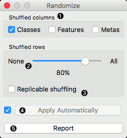
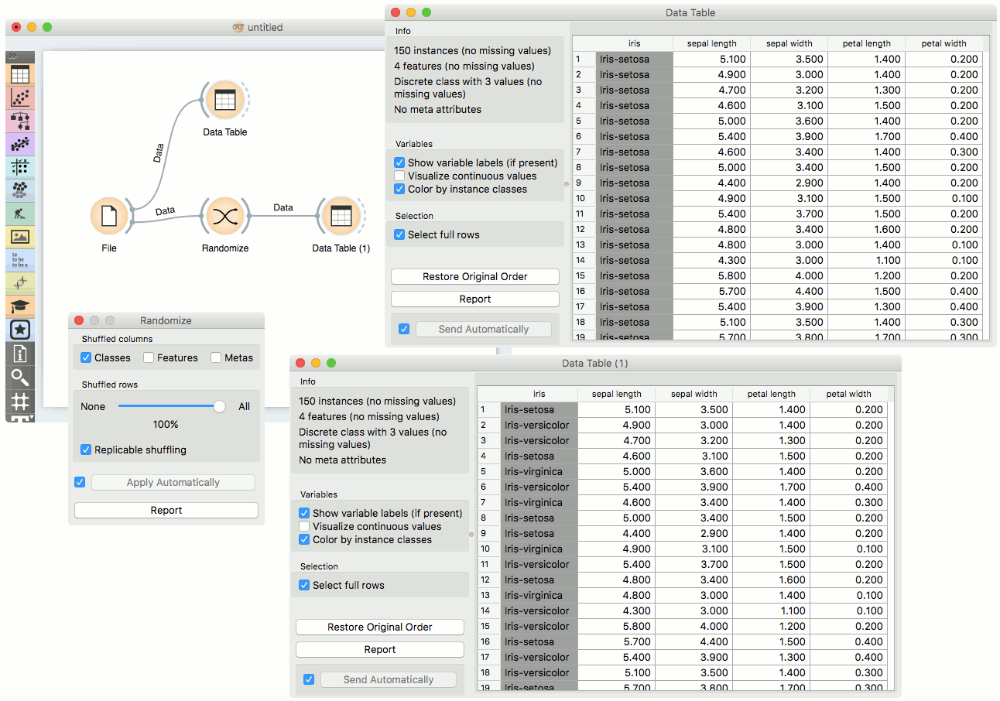
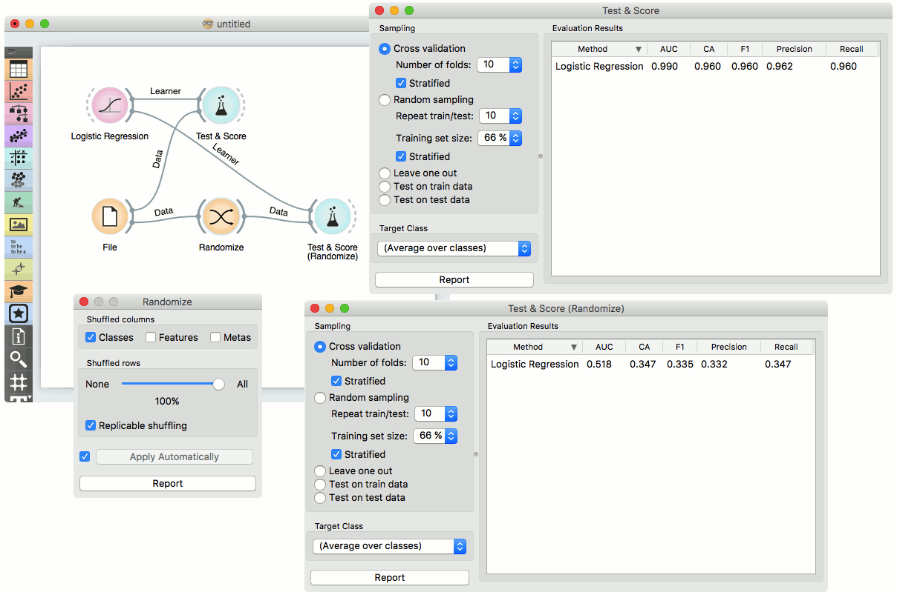

Randomize
=========

Shuffles classes, attributes and/or metas of an input dataset.

Inputs
    Data
        input dataset

Outputs
    Data
        randomized dataset

The **Randomize** widget receives a dataset in the input and outputs the same
dataset in which the classes, attributes or/and metas are shuffled.

1. Select group of columns of the dataset you want to shuffle.

2. Select proportion of the dataset you want to shuffle.

3. Produce replicable output.

4. If *Apply automatically* is ticked, changes are committed automatically.
   Otherwise, you have to press *Apply* after each change.
5. Produce a report.

Example
-------

The **Randomize** widget is usually placed right after
(e.g. :doc:`File <../data/file>` widget. The basic usage is shown in the following
workflow, where values of class variable of Iris dataset are randomly shuffled.

In the next example we show how shuffling class values influences model
performance on the same dataset as above.

