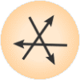

Randomize
=========

Shuffles classes, features and/or metas of data.

Signals
-------

**Inputs**:

-  **Data**

   Data set.

**Outputs**:

-  **Data**

   Randomized data set.

Description
-----------

A simple widget that shuffles classes, features and/or metas of data.
