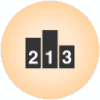
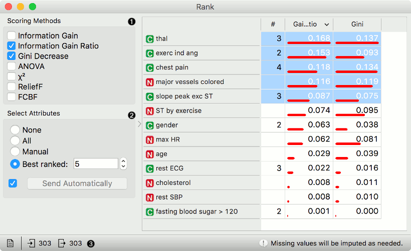
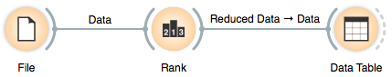
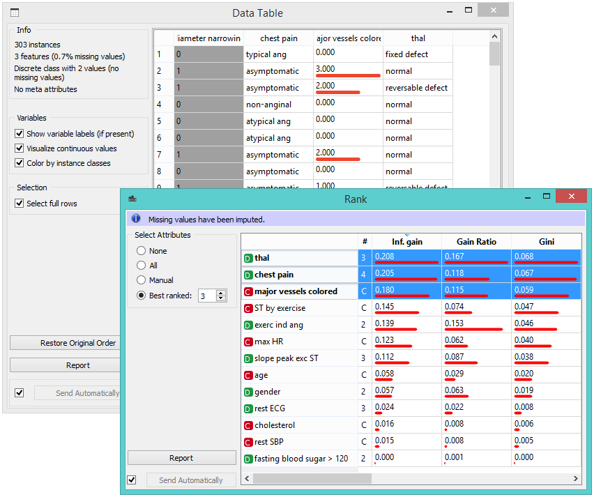
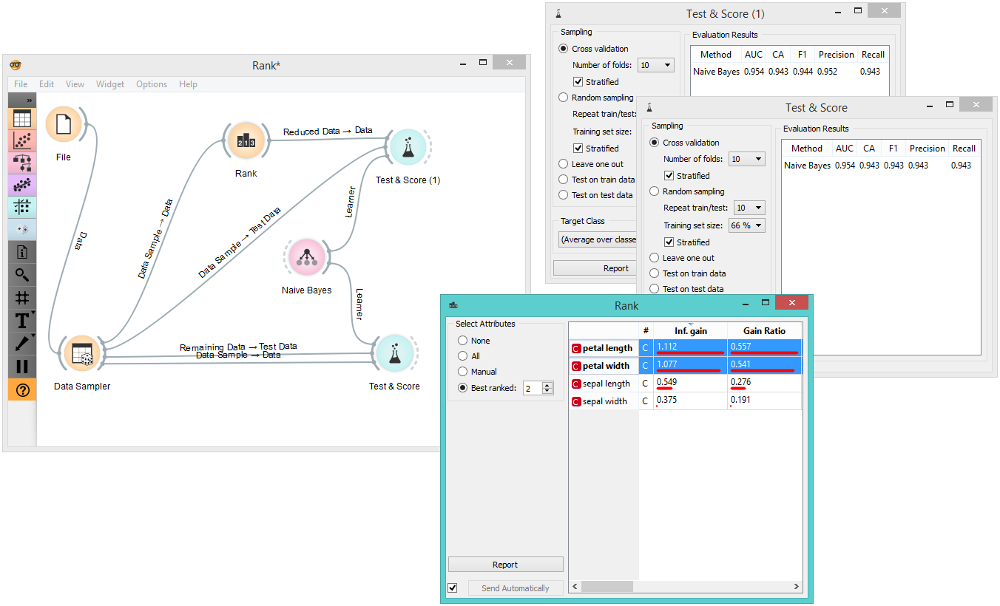

Rank
====

Ranking of attributes in classification or regression data sets.

Signals
-------

**Inputs**:

-  **Data**

   An input data set.

- **Scorer**  (multiple)

  Models that implement the feature scoring interface, such as linear /
  logistic regression, random forest, stochastic gradient descent, etc.

**Outputs**:

-  **Reduced Data**

   A data set whith selected attributes.

Description
-----------

The **Rank** widget considers class-labeled data sets (classification or
regression) and scores the attributes according to their correlation
with the class.

1. Select attributes from the data table.
2. Data table with attributes (rows) and their scores by different
   scoring methods (columns)
3. Produce a report. 
4. If '*Send Automatically*' is ticked, the widget automatically
   communicates changes to other widgets.

Scoring methods
---------------

1. Information Gain: the expected amount of information (reduction of entropy)
2. `Gain Ratio <https://en.wikipedia.org/wiki/Information_gain_ratio>`_: a ratio of the information gain and the attribute's intrinsic information, which reduces the bias towards multivalued features that occurs in information gain
3. `Gini <https://en.wikipedia.org/wiki/Gini_coefficient>`_: the inequality among values of a frequency distribution
4. `ANOVA <https://en.wikipedia.org/wiki/One-way_analysis_of_variance>`_: the difference between average vaules of the feature in different classes
5. `Chi2 <https://en.wikipedia.org/wiki/Chi-squared_distribution>`_: dependence between the feature and the class as measure by the chi-square statistice
6. `ReliefF <https://en.wikipedia.org/wiki/Relief_(feature_selection)>`_: the ability of an attribute to distinguish between classes on similar data instances
7. `FCBF (Fast Correlation Based Filter) <https://www.aaai.org/Papers/ICML/2003/ICML03-111.pdf>`_: entropy-based measure, which also identifies redundancy due to pairwise correlations between features

Additionally, you can connect certain learners that enable scoring the features
according to how important they are in models that the learners build (e.g.
:ref:`Linear <model.lr>` / :ref:`Logistic Regression <model.logit>`,
:ref:`Random Forest <model.rf>`, :ref:`SGD <model.sgd>`, …).

Example: Attribute Ranking and Selection
----------------------------------------

Below,  we have used the **Rank** widget immediately after the :doc:`File<../data/file>`
widget to reduce the set of data attributes and include only the most
informative ones:

Notice how the widget outputs a data set that includes only the
best-scored attributes:

Example: Feature Subset Selection for Machine Learning
------------------------------------------------------

What follows is a bit more complicated example. In the workflow below, we
first split the data into a training set and a test set. In the upper branch, the
training data passes through the **Rank** widget to select the most
informative attributes, while in the lower branch there is no feature
selection. Both feature selected and original data sets are passed to
their own :doc:`Test & Score <../evaluation/testandscore>` widgets, which develop a *Naive Bayes*
classifier and score it on a test set.

For data sets with many features, a naive Bayesian classifier feature
selection, as shown above, would often yield a better predictive
accuracy.
