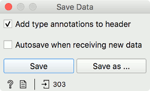

Save Data
=========

Saves data to a file.

**Inputs**

- Data: input dataset

The **Save Data** widget considers a dataset provided in the input channel and saves it to a data file with a specified name. It can save the data as:

- a tab-delimited file (.tab)
- comma-separated file (.csv)
- pickle (.pkl), used for storing preprocessing of [Corpus](https://orange.biolab.si/widget-catalog/text-mining/corpus-widget/) objects
- Excel spreadsheets (.xlsx)
- spectra ASCII (.dat)
- hyperspectral map ASCII (.xyz)
- compressed formats (.tab.gz, .csv.gz, .pkl.gz)

The widget does not save the data every time it receives a new signal in the input as this would constantly (and, mostly, inadvertently) overwrite the file. Instead, the data is saved only after a new file name is set or the user pushes the *Save* button.

If the file is saved to the same directory as the workflow or in the subtree of that directory, the widget remembers the relative path. Otherwise, it will store an absolute path but disable auto save for security reasons.

- *Add type annotations to header*: Include Orange's three-row header in the output file.
- *Autosave when receiving new data*: Always save new data. Be careful! This will overwrite existing data on your system.
- *Save* by overwriting the existing file.
- *Save as* to create a new file.

Example
-------

In the workflow below, we used the *Zoo* dataset. We loaded the data into the [Scatter Plot](../visualize/scatterplot.md) widget, with which we selected a subset of data instances and pushed them to the **Save Data** widget to store them in a file.

