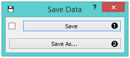
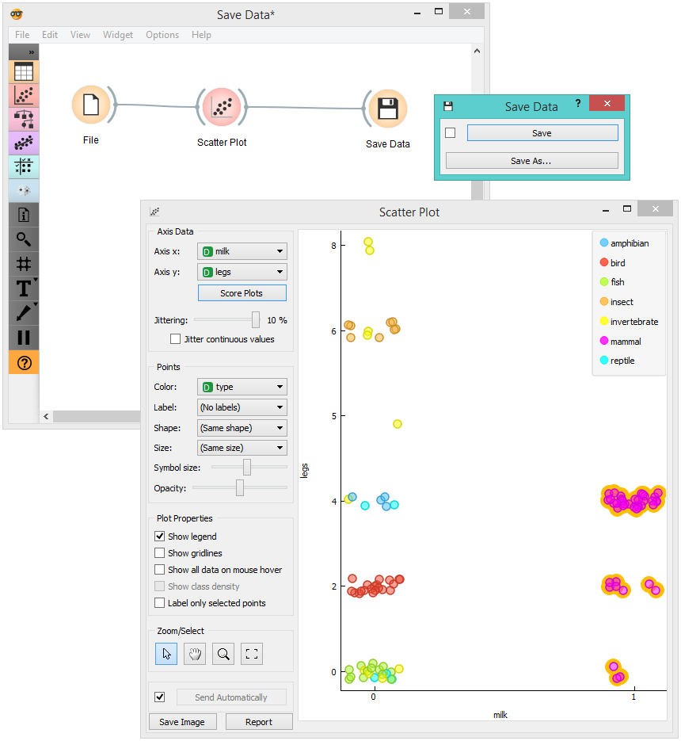

Save Data
=========

Saves data to a file.

Signals
-------

**Inputs**:

-  **Data**

   A data set.

**Outputs**:

-  (None)

Description
-----------

The **Save Data** widget considers a data set provided in the input channel
and saves it to a data file with a specified name. It can save the
data as a tab-delimited or a comma-separated file.

The widget does not save the data every time it receives a new signal in
the input as this would constantly (and, mostly, inadvertently)
overwrite the file. Instead, the data is saved only after a new file
name is set or the user pushes the *Save* button.

1. Save by overwriting the existing file.
2. *Save as* to create a new file. 

Example
-------

In the workflow below, we used the *Zoo* data set. We loaded the data into the :doc:`Scatter Plot <../visualize/scatterplot>` widget, with which
we selected a subset of data instances and pushed them to the
**Save Data** widget to store them in a file.

