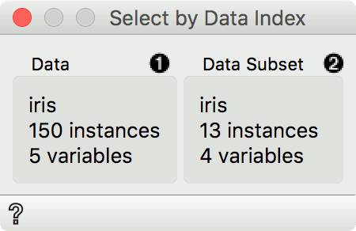
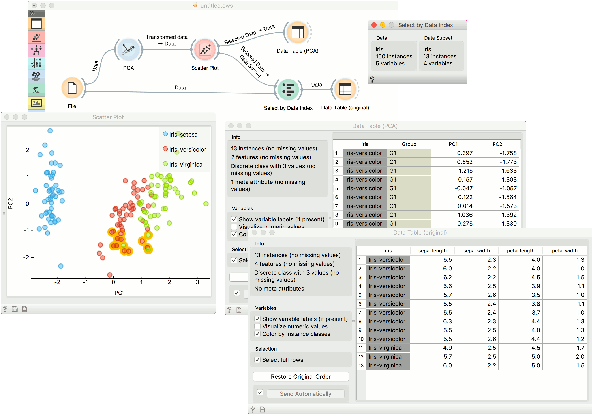

Select by Data Index
====================

Match instances by index from data subset.

**Inputs**

- Data: reference data set
- Data Subset: subset to match

**Outputs**

- Matching data: subset from reference data set that matches indices from subset data
- Unmatched data: subset from reference data set that does not match indices from subset data
- Annotated data: reference data set with an additional column defining matches

**Select by Data Index** enables matching the data by indices. Each row in a data set has an index and given a subset, this widget can match these indices to indices from the reference data. Most often it is used to retrieve the original data from the transformed data (say, from PCA space).

1. Information on the reference data set. This data is used as index reference.
2. Information on the data subset. The indices of this data set are used to find matching data in the reference data set. Matching data are on the output by default.

Example
-------

A typical use of **Select by Data Index** is to retrieve the original data after a transformation. We will load *iris.tab* data in the [File](../data/file.md) widget. Then we will transform this data with [PCA](../unsupervised/PCA.md). We can project the transformed data in a [Scatter Plot](../visualize/scatterplot.md), where we can only see PCA components and not the original features.

Now we will select an interesting subset (we could also select the entire data set). If we observe it in a [Data Table](../data/datatable.md), we can see that the data is transformed. If we would like to see this data with the original features, we will have to retrieve them with **Select by Data Index**.

Connect the original data and the subset from [Scatter Plot](../visualize/scatterplot.md) to **Select by Data Index**. The widget will match the indices of the subset with the indices of the reference (original) data and output the matching reference data. A final inspection in another [Data Table](../data/datatable.md) confirms the data on the output is from the original data space.

