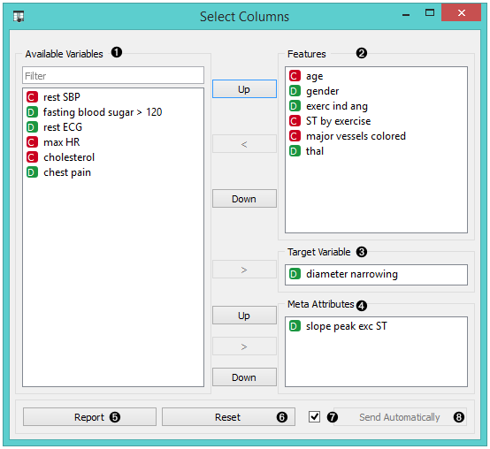
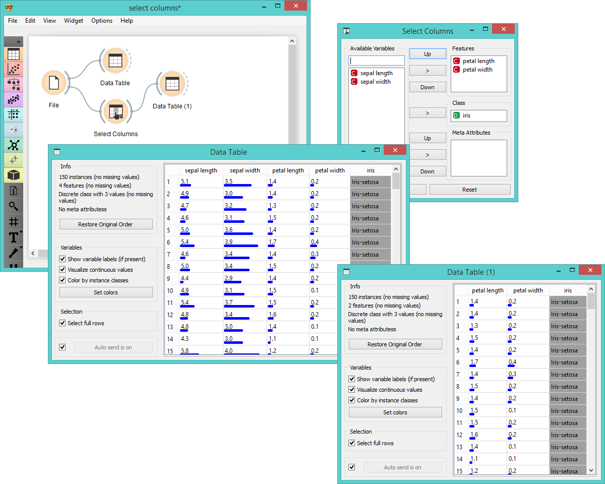
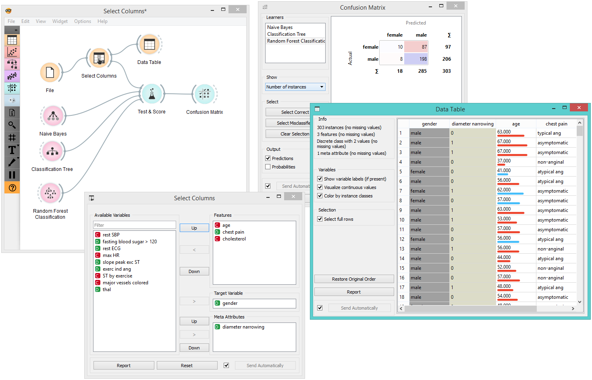

Select Columns
==============

Manual selection of data attributes and composition of data domain.

Signals
-------

**Inputs**:

-  **Data**

   Attribute-valued data set.

**Outputs**:

-  **Data**

   Attribute-valued data set composed using the domain specification from
   the widget.

Description
-----------

The **Select Columns** widget is used to manually compose your `data domain <https://en.wikipedia.org/wiki/Data_domain>`_. The user can decide
which attributes will be used and how. Orange distinguishes between
ordinary attributes, (optional) class attributes and meta attributes.
For instance, for building a classification model, the domain would be
composed of a set of attributes and a discrete class attribute. Meta
attributes are not used in modelling, but several widgets can use them
as instance labels.

Orange attributes have a type and are either discrete, continuous or a
character string. The attribute type is marked with a symbol appearing
before the name of the attribute (D, C, S, respectively).

1. Left-out data attributes that will not be in the output data file
2. Data attributes in the new data file
3. Target variable. If none, the new data set will be without a target variable. 
4. Meta attributes of the new data file. These attributes are included
   in the data set but are, for most methods, not considered in the
   analysis.
5. Produce a report.
6. Reset the domain composition to that of the input data file.
7. Tick if you wish to auto-apply changes of the data domain. 
8. Apply changes of the data domain and send the new data file to the
   output channel of the widget.

Examples
--------

In the workflow below, the *Iris* data from the :doc:`File <../data/file>` widget is fed into
the **Select Columns** widget, where we select to output only two
attributes (namely petal width and petal length). We view both the
original data set and the data set with selected columns in the :doc:`Data
Table <../data/datatable>` widget.

For a more complex use of the widget, we composed a workflow to redefine
the classification problem in the *heart-disease* data set. Originally, the
task was to predict if the patient has a coronary artery diameter
narrowing. We changed the problem to that of gender classification, based
on age, chest pain and cholesterol level, and informatively kept the
diameter narrowing as a meta attribute.

