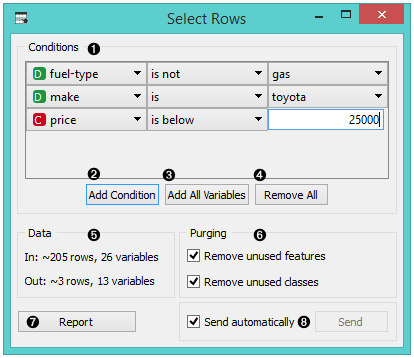
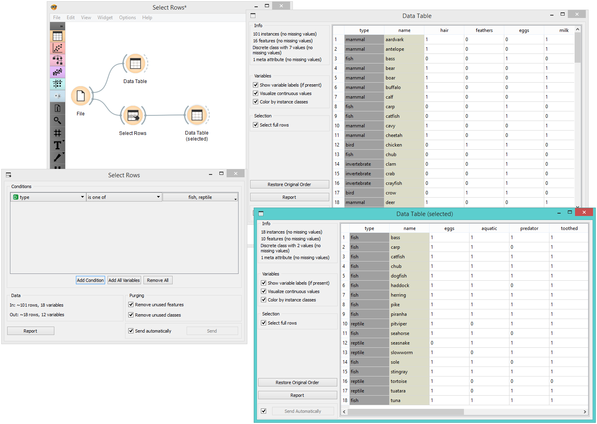
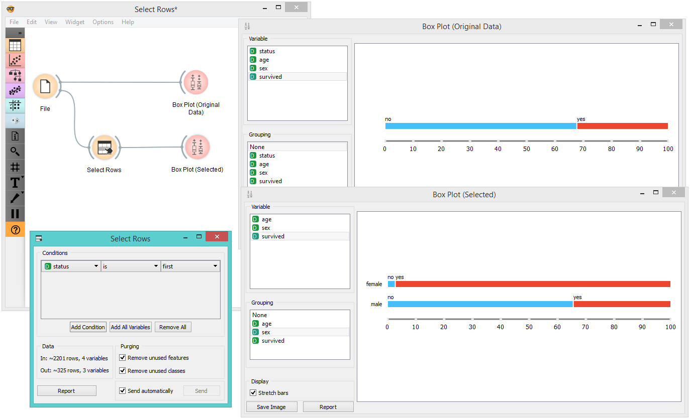

Select Rows
===========

Selects data instances based on conditions over data features.

Inputs
    Data
        input dataset

Outputs
    Matching Data
        instances that match the conditions
    Non-Matching Data
        instances that do not match the conditions
    Data
        data with an additional column showing whether a instance is selected

This widget selects a subset from an input dataset, based on user-defined
conditions. Instances that match the selection rule are placed in the
output *Matching Data* channel.

Criteria for data selection are presented as a collection of conjuncted
terms (i.e. selected items are those matching all the terms in
'*Conditions*').

Condition terms are defined through selecting an attribute, selecting an operator from a list of operators, and, if needed, defining the
value to be used in the condition term. Operators are different for
discrete, continuous and string attributes.

1. Conditions you want to apply, their operators and related values
2. Add a new condition to the list of conditions.
3. Add all the possible variables at once.
4. Remove all the listed variables at once.
5. Information on the input dataset and information on instances that match the condition(s)
6. Purge the output data.
7. When the *Send automatically* box is ticked, all changes will be
   automatically communicated to other widgets.
8. Produce a report. 

Any change in the composition of the condition will update the information
pane (*Data Out*).

If *Send automatically* is selected, then the output is updated on any
change in the composition of the condition or any of its terms.

Example
-------

In the workflow below, we used the *Zoo* data from the :doc:`File <../data/file>` widget and
fed it into the **Select Rows** widget. In the widget, we chose to output only
two animal types, namely fish and reptiles. We can inspect both the
original dataset and the dataset with selected rows in the :doc:`Data
Table <../data/datatable>` widget.

In the next example, we used the data from the *Titanic* dataset and
similarly fed it into the :doc:`Box Plot <../visualize/boxplot>` widget. We first observed the
entire dataset based on survival. Then we selected only first class passengers in the **Select Rows** widget and fed it again into the :doc:`Box Plot <../visualize/boxplot>`.
There we could see all the first class passengers listed by their survival rate and grouped by gender. 

