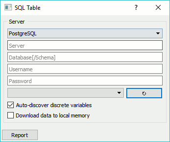

SQL Table
=========

Reads data from an SQL database.

Signals
-------

**Inputs**:

-  (None)

**Outputs**:

-  **Data**

   Attribute-valued data from the database

Description
-----------

The **SQL** widget accesses data stored in an SQL database. It can
connect to PostgreSQL (requires `psycopg2 <http://initd.org/psycopg/>`_ module) 
or `SQL Server <https://www.microsoft.com/en-us/sql-server/>`_
(requires `pymssql <http://pymssql.org/en/stable/>`_ module).

