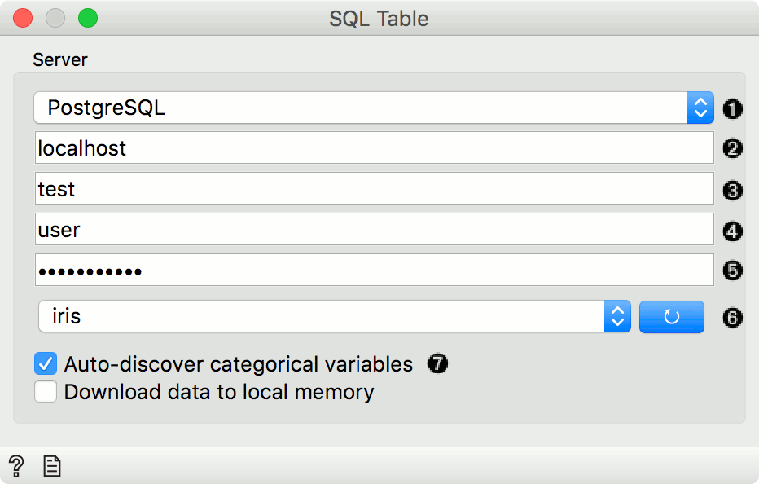
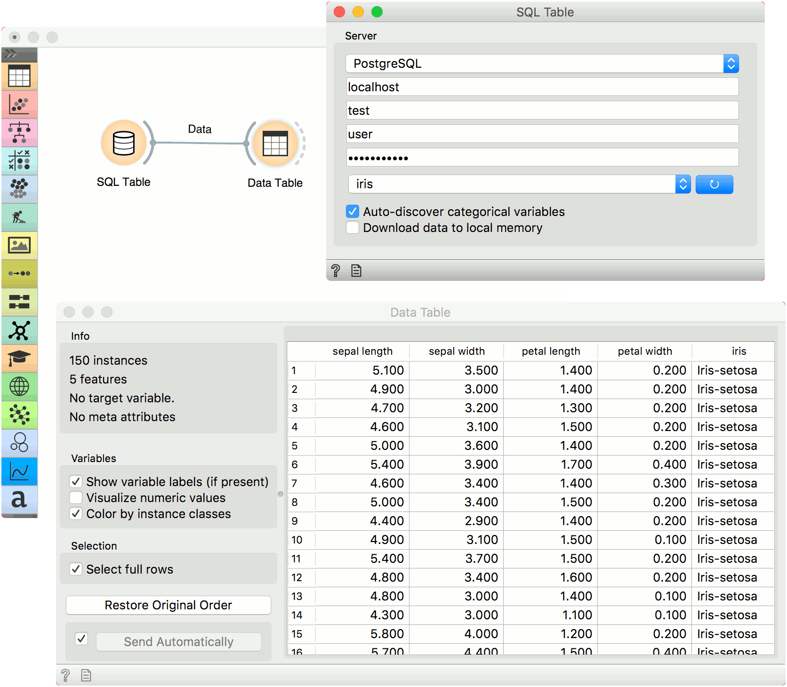

SQL Table
=========

Reads data from an SQL database.

Outputs
    Data
        dataset from the database

The **SQL** widget accesses data stored in an SQL database. It can connect to PostgreSQL (requires `psycopg2 <http://initd.org/psycopg/>`_ module) or `SQL Server <https://www.microsoft.com/en-us/sql-server/>`_ (requires `pymssql <http://pymssql.org/en/stable/>`_ module).

To handle large databases, Orange attempts to execute a part of the computation in the database itself without downloading the data. This only works with PostgreSQL database and requires quantile and tsm_system_time `extensions <https://github.com/biolab/orange3/wiki/Installation-of-SQL-extensions>`_ installed on server. If these extensions are not installed, the data will be downloaded locally.

1. Database type (can be either PostgreSQL or MSSQL).
2. Host name.
3. Database name.
4. Username.
5. Password.
6. Press the blue button to connect to the database. Then select the table in the dropdown.
7. *Auto-discover categorical variables* will cast INT and CHAR columns with less than 20 distinct values as categorical variables (finding all distinct values can be slow on large tables). When not selected, INT will be treated as numeric and CHAR as text. *Download to local memory* downloads the selected table to your local machine.

Installation Instructions
-------------------------

PostgreSQL
++++++++++

Install the backend.

.. code:: 

	pip install psycopg2

Alternatively, you can follow `these instructions <https://blog.biolab.si/2018/02/16/how-to-enable-sql-widget-in-orange/>`__ for installing the backend.

`Install the extensions <https://github.com/biolab/orange3/wiki/Installation-of-SQL-extensions>`__. [optional]

MSSQL
+++++

Install the backend.

.. code:: 

	pip install pymssql

If you are encountering issues, follow `these instructions <https://github.com/biolab/orange3/wiki/Installation-of-SQL-extensions#mssql>`__.

Example
-------

Here is a simple example on how to use the **SQL Table** widget. Place the widget on the canvas, enter your database credentials and connect to your database. Then select the table you wish to analyse.

Connect **SQL Table** to :doc:`Data Table<../data/datatable>` widget to inspect the output. If the table is populated, your data has transferred correctly. Now, you can use the **SQL Table** widget in the same way as the :doc:`File<../data/file>` widget.

