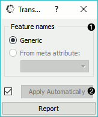
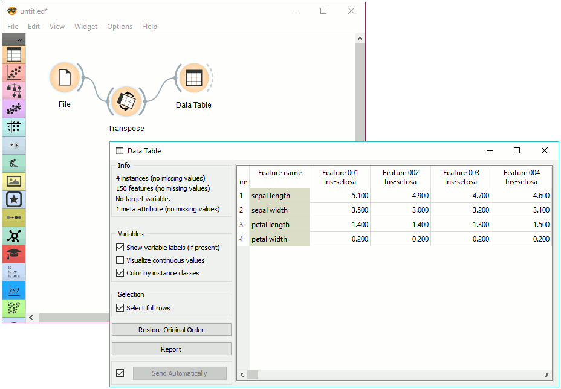

Transpose
=========

Transposes a data table.

Signals
-------

**Inputs**:

-  **Data**

   A data set.

**Outputs**:

-  **Data**

   Transposed data set

Description
-----------

**Transpose** widget transposes data table.

Example
-------

This is a simple workflow showing how to use **Transpose**. Connect the widget to
:doc:`File <file>` widget. The output of **Transpose** is a transposed data table
with rows as columns and columns as rows. You can observe the result in a :doc:`Data Table <datatable>`.

