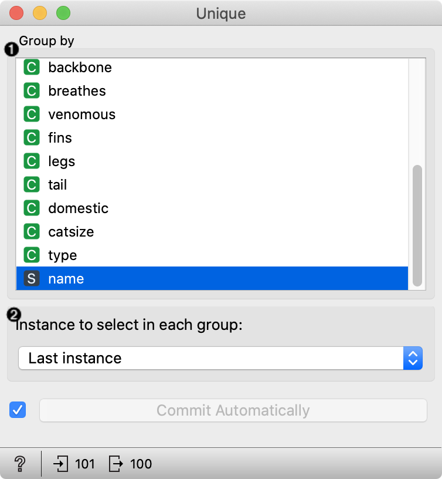
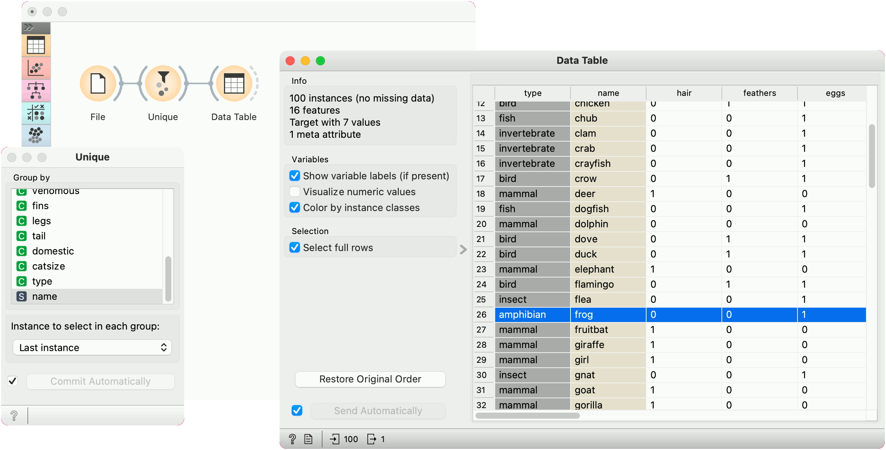

Unique
======

Remove duplicated data instances.

**Inputs**

- Data: data table

**Outputs**

- Data: data table without duplicates

The widget removes duplicated data instances. The user can choose a subset of observed variables, so two instances are considered as duplicates although they may differ in values of other, ignored variables.

1. Select the variables that are considered in comparing data instances.
2. Data instance that is kept. The options are to use the first, last, middle or random instance, or to keep none, that is, to remove duplicated instances altogether.

Example
-------

Data set *Zoo* contains two frogs. This workflow keeps only one by removing instances with the same names.

