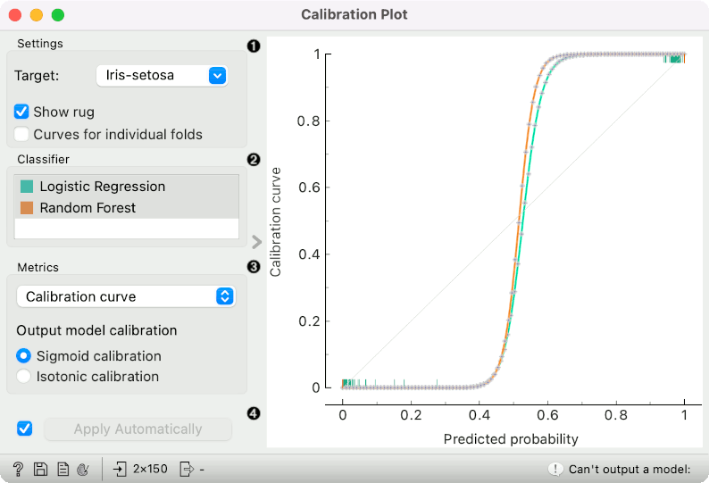
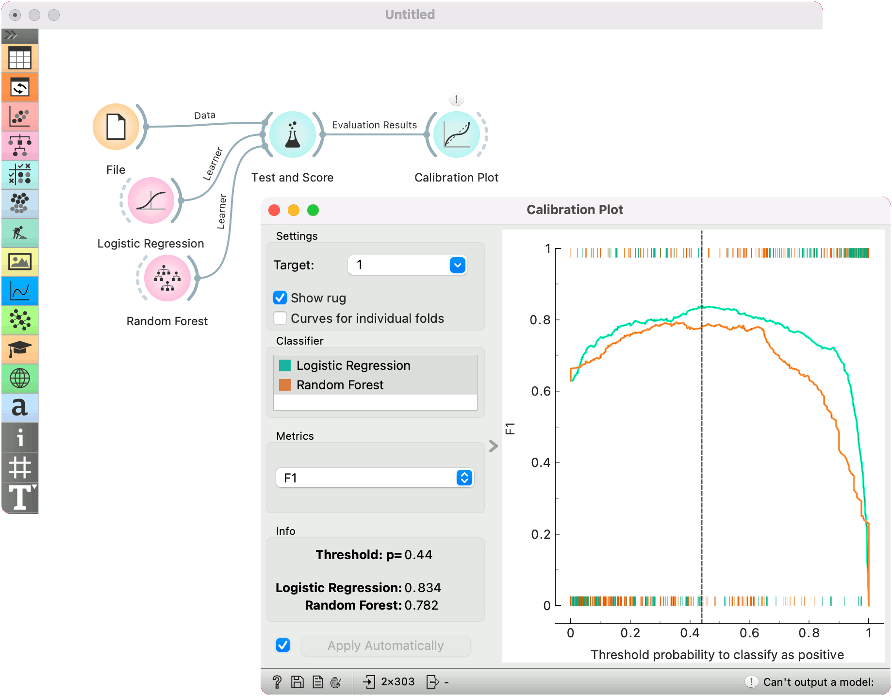
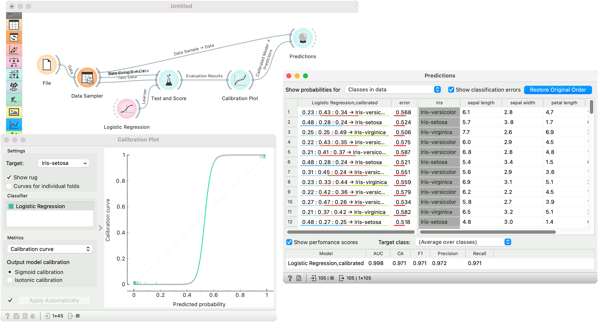

Calibration Plot
================

Shows the match between classifiers' probability predictions and actual class probabilities.

**Inputs**

- Evaluation Results: results of testing classification algorithms

**Outputs**

- Calibrated Model: a model with calibrated probabilities or a model with the same probabilities but different classification threshold

The [Calibration Plot](https://en.wikipedia.org/wiki/Calibration_curve) plots probabilities predicted by the classifier(s) against actual class probabilities. We would use this widget to see whether a classifier is overly optimistic (gives predominantly positive results) or pessimistic (gives predominantly negative results). The widget can also output a calibrated model, where the user sets his/her own probability threshold.

1. Select the desired target class from the drop down menu.
   - *Show rug*: If enabled, ticks are displayed at the bottom and the top of the graph, which represent negative and positive examples respectively. Their position corresponds to the classifier's probability prediction. Different colors represent different classifiers. At the bottom of the graph, the points to the left are those which are (correctly) assigned a low probability of the target class, and those to the right are incorrectly assigned high probabilities. At the top of the graph, the instances to the right are correctly assigned high probabilities and vice versa.
   - Curves for individual folds: a curve is displayed for each fold from the [Test and Score](testandscore.md) widget.
2. Choose which classifiers to plot. Colors in the list of classifiers correspond to colors used in the plot. The diagonal represents optimal behavior when *Calibration curve* is selected; the closer the classifier's curve gets, the more accurate its prediction probabilities are.
3. Select the metric to calibrate:
   - *calibration curve*: displays calibration curves for multiple models. The options for smoothing functions are [Sigmoid](https://en.wikipedia.org/wiki/Sigmoid_function) or [Isotonic](https://en.wikipedia.org/wiki/Isotonic_regression) function.
   - *classification accuracy*: displays classification accurracy at changing probability thresholds. Threshold can be set by dragging the vertical line left or right.
   - *F1*: displays F1 score at changing probability thresholds. Threshold can be set by dragging the vertical line left or right.
   - *sensitivity and specificity*: displays the relationship between [sensitivity and specificity](https://en.wikipedia.org/wiki/Sensitivity_and_specificity) at changing probability thresholds.
   - *precision and recall*: displays the relationship between [precision and recall](https://en.wikipedia.org/wiki/Precision_and_recall) at changing probability thresholds.
   - *pos and neg predictive value*: displays the relationship between [positive and negative predictive values](https://en.wikipedia.org/wiki/Positive_and_negative_predictive_values) at changing probability thresholds.
   - *true and false positive rate*: displays the relationship between [TP and FP rate](https://en.wikipedia.org/wiki/False_positives_and_false_negatives) at changing probability thresholds.
4. If *Apply Automatically* is ticked, changes are communicated automatically. Alternatively, click *Apply*.

When the widget shows the calibration curve, it outputs a calibrated model, whose predicted probabilities are tuned to better match the actual probabilities.

When showing other curves (such as F1), the widget outputs a model that gives the same probabilities, but class predictions are made at thresholds different from 0.5. For instance, if we drag the vertical line shown in the graph to 0.3, the widget outputs a model that predicts a positive class when its probability exceeds 30%.

The widget cannot output a model if the input data contains models obtained from multiple runs (for instance from cross validation or repeated sampling). If multiple models and on the input, only a single one must be chosen in order to have it on the output. The widget also cannot output calibrated model for non-binary classes.

Examples
--------

At the moment, only two widgets give the signal of the correct type for **Calibration Plot**: [Test and Score](../evaluate/testandscore.md) and [Predictions](../evaluate/predictions.md). The Calibration Plot will always follow one of them.

Here is a typical example on the iris data, where we compare two classifiers (namely [Logistic Regression](../model/logisticregression.md) and [Random Forest](../model/randomforest.md)) and input them into [Test and Score](../evaluate/testandscore.md). Test and Score displays evaluation results for each classifier. Then we draw **Calibration Plot** to further analyze the performance of the classifiers. **Calibration Plot** enables you to see prediction accuracy of class probabilities in a plot.

Judging by the observed curve, the classifier is overly "cautious". Even when it predicts probabilities of around 0.4, the actual class probability is still 0. Conversely, when the classifier is only 0.6 certain that the class is positive, the actual probability of positive class is already almost 1.

The widget is set to optimize F1 score. The user can drag the vertical black line left or right to set the probability threshold for the select target value. The information on the calibrated classifier are displayed in the info box on the left.

In the second example, we show how to use the widget to output a calibrated model. We use [Data Sampler](../data/datasampler.md) to split the data into training and test subsets. We pass both the training and test subsets to **Test and Score** and train a [Logistic Regression](../model/logisticregression.md) model, which we pass to **Calibration Plot**. Note that only a single calibrated model can be on the output, hence the user must select a single model from the classifier list.

Once the model is calibrated, we can pass it to [Predictions](../evaluate/predictions.md) and use it on training data.

