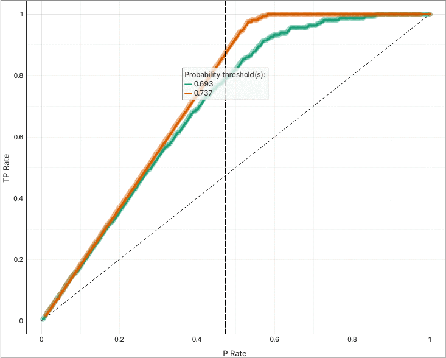
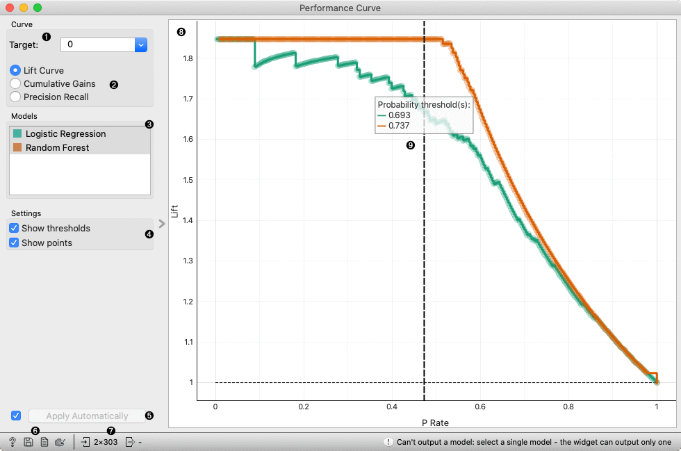

Lift Curve
==========

Measures the performance of a chosen classifier against a random classifier.

**Inputs**

- Evaluation Results: results of testing classification algorithms

The **Lift curve** shows the curves for analysing the proportion of true positive data instances in relation to the classifier's threshold or the number of instances that we classify as positive.

Cumulative gains chart shows the proportion of true positive instances (for example, the number of clients who accept the offer) as a function of the number of positive instances (the number of clients contacted), assuming the the instances are ordered according to the model's probability of being positive (e.g. ranking of clients).

Lift curve shows the ratio between the proportion of true positive instances in the selection and the proportion of customers contacted. See [a tutorial for more details](https://medium.com/analytics-vidhya/understanding-lift-curve-b674d21e426).

1. Choose the desired *Target class*. The default is chosen alphabetically.
2. Choose whether to observe lift curve or cumulative gains.
3. If test results contain more than one classifier, the user can choose which curves she or he wants to see plotted. Click on a classifier to select or deselect the curve.
4. *Show lift convex hull* plots a convex hull over lift curves for all classifiers (yellow curve). The curve shows the optimal classifier (or combination thereof) for each desired lift or cumulative gain.
5. Press *Save Image* to save the created image in a .svg or .png format.
6. Produce a report.
7. A plot with **lift** or **cumulative gain** vs. **positive rate**. The dashed line represents the behavior of a random classifier.

Example
-------

The widgets that provide the right type of the signal needed by the **Lift Curve** (evaluation data) are [Test & Score](../evaluate/testandscore.md) and [Predictions](../evaluate/predictions.md).

In the example below, we observe the lift curve and cumulative gain for the bank marketing data, where the classification goal is to predict whether the client will accept a term deposit offer based on his age, job, education, marital status and similar data. The data set is available in the Datasets widget. We run the learning algorithms in the Test and Score widget and send the results to Lift Curve to see their performance against a random model. Of the two algorithms tested, logistic regression outperforms the naive Bayesian classifier. The curve tells us that by picking the first 20 % of clients as ranked by the model, we are going to hit four times more positive instances than by selecting a random sample with 20 % of clients.
