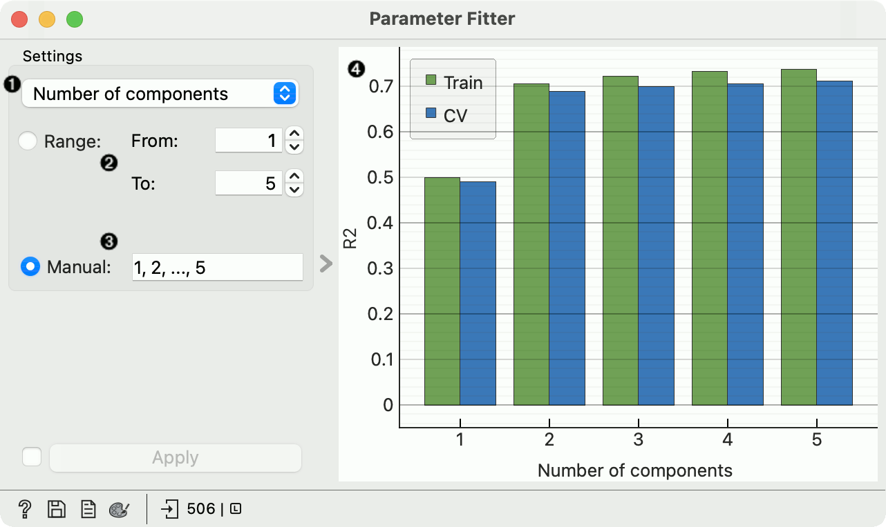

Parameter Fitter
================

Find the best hyper-parameters for a model.

**Inputs**

- Data: input data
- Learner: learning algorithm

Parameter fitter shows performance of a learning algorithms with different settings of a hyper-parameter. The widget is currently limited to a single integer parameter. Not all learning algorithms support hyper-parameter tuning.

1. Choose the parameter to fit.
2. Define the lower and the upper limit; step size is determined automatically.
3. Alternatively, specifies the values for the parameter. The widget also accepts `...`, e.g. `1, 2, 3, ..., 10` or `40, 60, ..., 100`. When the parameter has a minimal value (e.g. the number of components cannot be negative), one can also omit the lower bound, e.g. `..., 80, 100`; and if the parameter has a maximal value, one can omit the upper bound, e.g. `2, 4, 6, ...,`.
4. A plot showing the performance at different values of the parameter. The graph shows AUC for classification problems and R2 for regression.