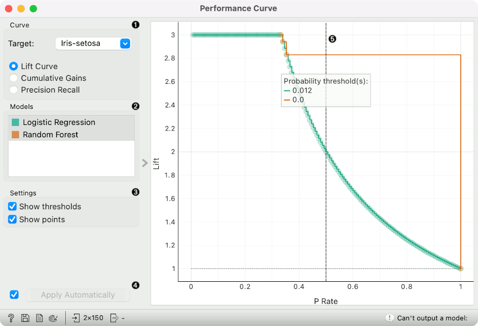
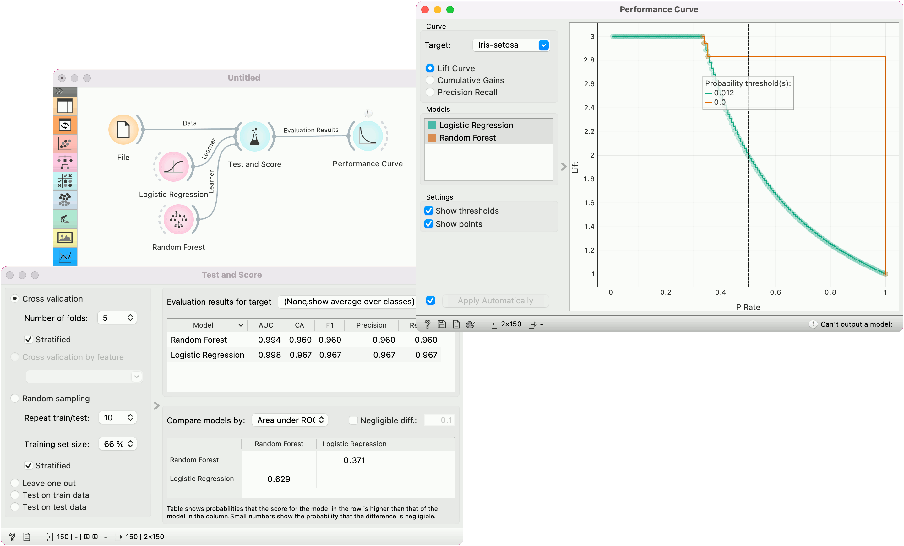
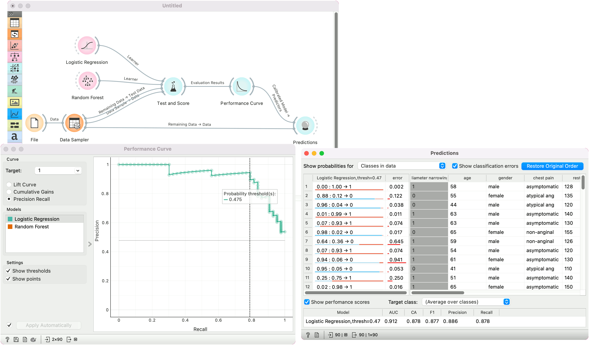

Performance Curve
=================

Construct and display a performance curve from the evaluation of classifiers.

**Inputs**

- Evaluation Results: results of testing classification algorithms

**Outputs**

- Calibrated Model: trained model using the calibrated learner

The **Performance Curve** shows the curves for analysing the proportion of true positive data instances in relation to the classifier's threshold or the number of instances that we classify as positive. It offers three types of performance curves: [lift curve](https://en.wikipedia.org/wiki/Lift_(data_mining)), [cumulative gains](http://mlwiki.org/index.php/Cumulative_Gain_Chart), and [precision-recall curve](https://scikit-learn.org/stable/auto_examples/model_selection/plot_precision_recall.html).

**Lift curve** shows the ratio between lift (the proportion of true positive instances to all positive instances in the prediction) and the proportion of positive instances. The higher the initial curve and the longer it is flat, the better the model. See [a tutorial for more details](https://medium.com/analytics-vidhya/understanding-lift-curve-b674d21e426).

**Cumulative gains** chart shows the ratio of true positive instances (for example, people with heart disease) and support, which is the fraction of positively predicted instances (the ratio of patients with a heart disease in the prediction), assuming that the instances are ordered according to the model's probability of being positive (e.g. how likely the person has the disease). The greater the area between the curve and the baseline (dashed diagonal line), the better the model.

**Precision-recall curve** shows the ratio between precision (ratio of true positives in positive predictions) and recall (ratio of true positives in positive class) at different thresholds. Ideally one aims at a high area under the curve.

1. Choose the desired *Target class*. The default is chosen alphabetically. Choose whether to observe lift curve, cumulative gains or precision-recall.
2. If test results contain more than one classifier, the user can choose which curves she or he wants to see plotted. Click on a classifier to select or deselect the curve.
3. *Show thresholds* plots a vertical dashed threshold line. The line represent at which probability threshold the prediction is considered positive. The line can be dragged left or right to change the threshold. *Show points* shows individual predictions as points on a plot. This option shows how many points were found at each value of x.
4. If *Apply Automatically* is ticked, changes are communicated automatically. Alternatively, click *Apply*.
5. A plot with the performance curve. The vertical dashed line represents the probability threshold and can be moved interactively. The diagonal dashed line in **cumulative gains** represents a baseline classifier.

Examples
--------

The widgets that provide the right type of the signal needed by the **Performance Curve** (evaluation data) are [Test and Score](../evaluate/testandscore.md) and [Predictions](../evaluate/predictions.md).

In the first example, we observe the lift curve and cumulative gain for the *iris* data, where the classification goal is to predict the type of iris based on the measurements of the flower. We run [Logistic Regression](../model/logisticregression.md) and [Random Forest](../model/randomforest.md) in the [Test and Score](../evaluate/testandscore.md) widget and send the results to **Performance Curve** to see their performance against a random model. Of the two algorithms tested, logistic regression outperforms the random forest. The curve tells us that by picking the first 34% of irises as ranked by the model and setting the probability threshold at 0.276, we are going to retain a perfect lift.

In the second example, we show how to calibrate a model in the **Performance Curve** widget. We are using the *heart-disease* data. First, the widget requires a single model on the input. This means cross-validation from Test and Score won't work, but there are as many models as there are folds. To pass a single model, use the *Test on test data* option.

In Performance Curve, we then observe the curve for the positive (1) class. The model has the optimal balance between precision and recall at the probability threshold of 0.475. We select this threshold and the model with the given threshold is sent to the output.

We can use this model in [Predictions](../evaluate/predictions.md) to predict on new data with the calibrated model. See also [Calibrated Learner](../model/calibratedlearner.md) for more calibration options.

