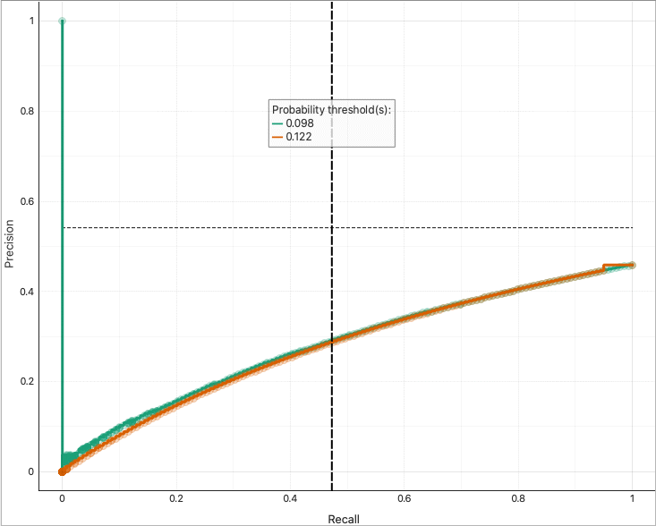
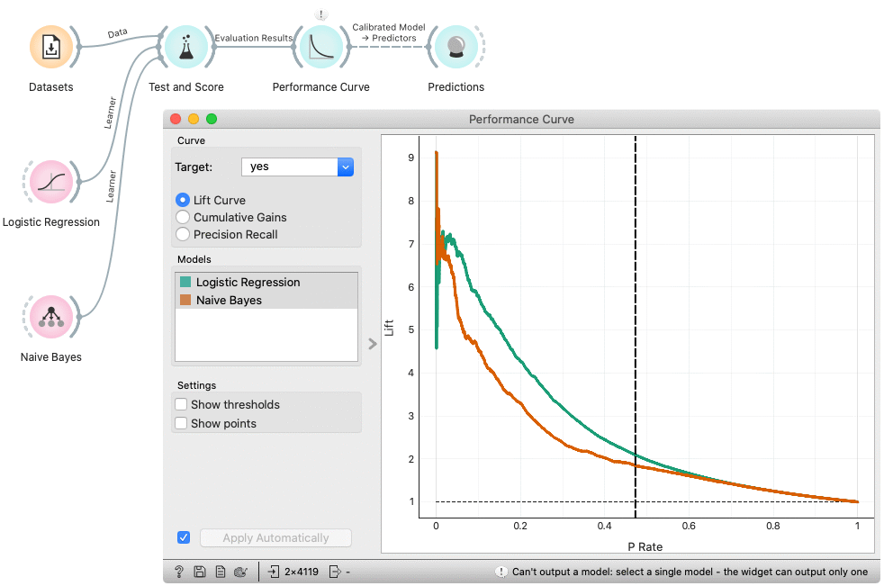

Performance Curve
=================

Measures the performance of a chosen classifier against a random classifier.

**Inputs**

- Evaluation Results: results of testing classification algorithms

**Outputs**

- Calibrated Model: a model with a different threshold

The **Performance curve** shows the curves for analysing the proportion of true positive data instances in relation to the classifier's threshold or the number of instances that we classify as positive.

1. Choose the desired *Target class*. The default is chosen alphabetically.
2. Choose whether to observe: 
   - *Lift Curve* shows the ratio between the proportion of true positive instances in the selection and the proportion of customers contacted. See [a tutorial for more details](https://medium.com/analytics-vidhya/understanding-lift-curve-b674d21e426).
   - *Cumulative Gains* shows the proportion of true positive instances (for example, the number of clients who accept the offer) as a function of the number of positive instances (the number of clients contacted), assuming that the instances are ordered according to the model's probability of being positive (e.g. ranking of clients):
   
   - *Precision Recall* shows the tradeoff between precision and recall for different threshold. Precision is defined as the number of true positives over the number of true positives plus the number of false positives. Recall is defined as the number of true positives over the number of true positives plus the number of false negatives.
   
3. If test results contain more than one classifier, the user can choose which curves she or he wants to see plotted. Click on a classifier to select or deselect the curve.
4. *Show thresholds* shows/hides a *Probability threshold(s) tooltip on a vertical (threshold) line.
   *Show points* shows/hides dots on the curve for every Lift/TP Rate/Precision-P Rate/Recall pair in the input results. The points tooltip is shown on hover.
5. If *Apply Automatically* is ticked, changes are communicated automatically. Alternatively, click *Apply*.
6. See help, press *Save Image* to save the created image in a .svg or .png format, produce a report or set visual settings.
7. Information the inputs and outputs. 
8. A plot with **lift**, **cumulative gain** or **precision recall** curve. The dashed (horizontal) line represents the behavior of a random classifier.
9. A threshold line with corresponding thresholds. It can be dragged left and right to set the output classifier's threshold. Since input classifiers may have different thresholds for the same P Rate/Recall, the output classifier is produced only when one input classifier is selected in the *Models* box.  

Example
-------

The widgets that provide the right type of the signal needed by the **Performance Curve** (evaluation data) are [Test & Score](../evaluate/testandscore.md) and [Predictions](../evaluate/predictions.md).

In the example below, we observe the lift curve, cumulative gain and precision recall curve for the bank marketing data, where the classification goal is to predict whether the client will accept a term deposit offer based on his age, job, education, marital status and similar data. The data set is available in the Datasets widget. We run the learning algorithms in the Test and Score widget and send the results to Performance Curve to see their performance against a random model. Of the two algorithms tested, logistic regression outperforms the naive Bayesian classifier. The curve tells us that by picking the first 20 % of clients as ranked by the model, we are going to hit four times more positive instances than by selecting a random sample with 20 % of clients.

