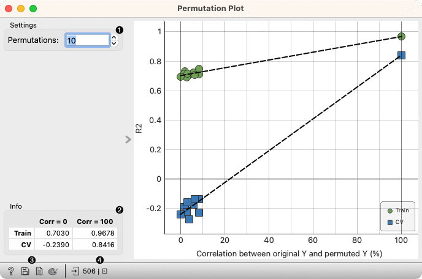
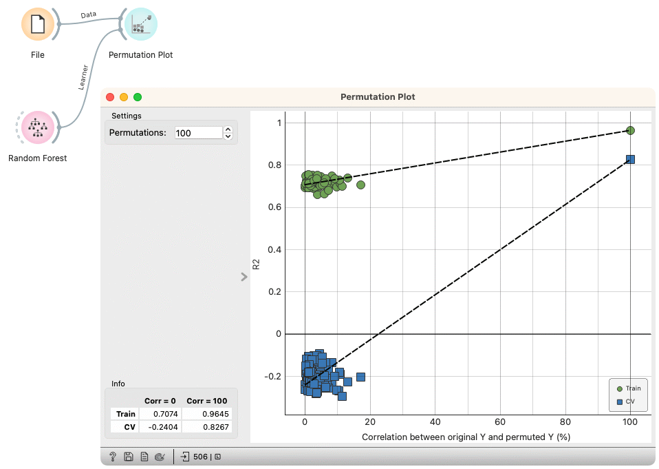

Permutation Plot
================

Check the validity and the degree of overfit for the input learner.

**Inputs**

- Data: input dataset
- Learner: learning algorithm

1. Select the number of permutations. The target variable is randomly permuted and the learner is fitted to each permuted dataset.
2. Information on the model performance.
3. Get help, save the plot, make the report, set plot properties.
4. Observe the size and type of inputs.

The Permutation plot displays the Spearman's rank correlation coefficient between the permuted and original target variable on the x-axis versus the model score (R2 for regression, AUC for classification) on the y-axis. Two sets of points are shown, one for evaluations on the training data and one for cross-validation. A regression line is fitted to each set of points. The intercept is a measure of the overfit. 

Examples
--------

Here is an example on the housing data, where we analyze the performance of a [Random Forest](../model/randomforest.md) model.

