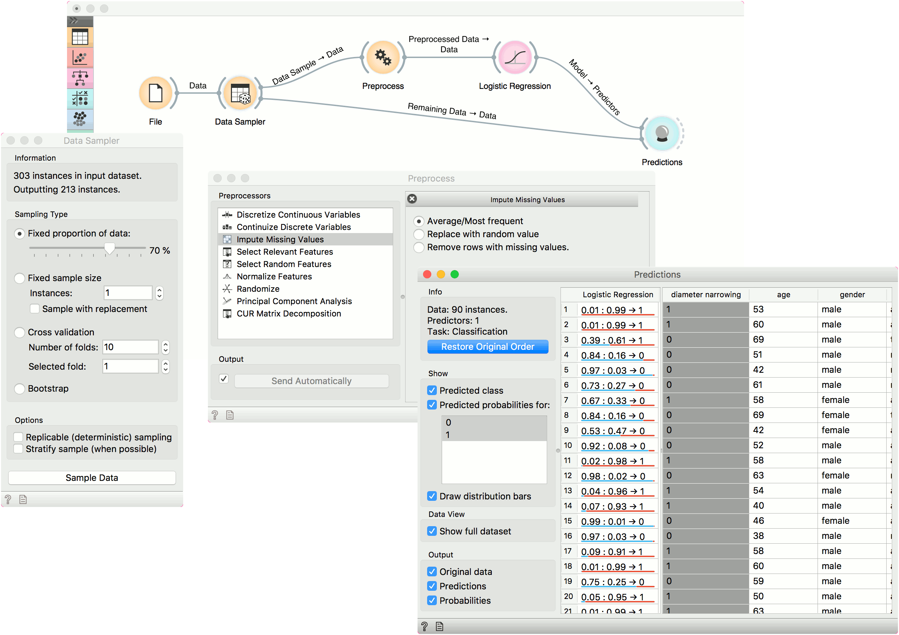

Predictions
===========

Shows models' predictions on the data.

**Inputs**

- Data: input dataset
- Predictors: predictors to be used on the data

**Outputs**

- Predictions: data with added predictions
- Evaluation Results: results of testing classification algorithms

The widget receives a dataset and one or more predictors (predictive models, not learning algorithms - see the example below). It outputs the data and the predictions.

1. Information on the input, namely the number of instances to predict, the number of predictors and the task (classification or regression). If you have sorted the data table by attribute and you wish to see the original view, press *Restore Original Order*.
2. You can select the options for classification. If *Predicted class* is ticked, the view provides information on predicted class. If *Predicted probabilities for* is ticked, the view provides information on probabilities predicted by the classifier(s). You can also select the predicted class displayed in the view. The option *Draw distribution bars* provides a visualization of probabilities.
3. By ticking the *Show full dataset*, you can view the entire data table (otherwise only class variable will be shown).
4. Select the desired output.
5. Predictions.

The widget show the probabilities and final decisions of [predictive models](https://en.wikipedia.org/wiki/Predictive_modelling). The output of the widget is another dataset, where predictions are appended as new meta attributes. You can select which features you wish to output (original data, predictions, probabilities). The result can be observed in a [Data Table](../data/datatable.md). If the predicted data includes true class values, the result of prediction can also be observed in a [Confusion Matrix](../evaluate/confusionmatrix.md).

Examples
--------

In the first example, we will use *Attrition - Train* data from the [Datasets](../data/datasets.md) widget. This is a data on attrition of employees. In other words, we wish to know whether a certain employee will resign from the job or not. We will construct a predictive model with the [Tree](../model/tree.md) widget and observe probabilities in **Predictions**.

For predictions we need both the training data, which we have loaded in the first **Datasets** widget and the data to predict, which we will load in another [Datasets](../data/datasets.md) widget. We will use *Attrition - Predict* data this time. Connect the second data set to **Predictions**. Now we can see predictions for the three data instances from the second data set.

The [Tree](../model/tree.md) model predicts none of the employees will leave the company. You can try other model and see if predictions change. Or test the predictive scores first in the [Test & Score](../evaluate/testandscore.md) widget.

In the second example, we will see how to properly use [Preprocess](../data/preprocess.md) with **Predictions** or [Test & Score](../evaluate/testandscore.md).

This time we are using the *heart disease.tab* data from the [File](../data/file.md) widget. You can access the data through the dropdown menu. This is a dataset with 303 patients that came to the doctor suffering from a chest pain. After the tests were done, some patients were found to have diameter narrowing and others did not (this is our class variable).

The heart disease data have some missing values and we wish to account for that. First, we will split the data set into train and test data with [Data Sampler](../data/datasampler.md).

Then we will send the *Data Sample* into [Preprocess](../data/preprocess.md). We will use *Impute Missing Values*, but you can try any combination of preprocessors on your data. We will send preprocessed data to [Logistic Regression](../model/logisticregression.md) and the constructed model to **Predictions**.

Finally, **Predictions** also needs the data to predict on. We will use the output of [Data Sampler](../data/datasampler.md) for prediction, but this time not the *Data Sample*, but the *Remaining Data*, this is the data that wasn't used for training the model.

Notice how we send the remaining data directly to **Predictions** without applying any preprocessing. This is because Orange handles preprocessing on new data internally to prevent any errors in the model construction. The exact same preprocessor that was used on the training data will be used for predictions. The same process applies to [Test & Score](../evaluate/testandscore.md).

