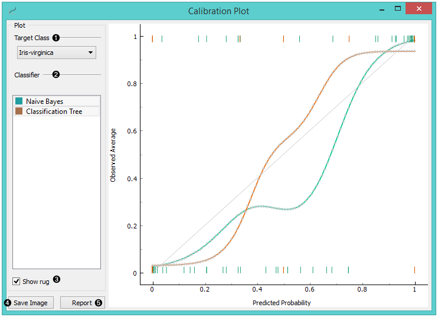

Calibration Plot
================

Shows the match between classifiers’ probability predictions and actual
class probabilities.

Inputs
    Evaluation Results
        results of testing classification algorithms

The `Calibration Plot <https://en.wikipedia.org/wiki/Calibration_curve>`_ plots class
probabilities against those predicted by the classifier(s).

1. Select the desired target class from the drop down menu.
2. Choose which classifiers to plot. The diagonal represents optimal behaviour; the closer the classifier's curve gets, the more accurate its prediction probabilities are. Thus we would use this widget to see whether a classifier is overly optimistic (gives predominantly positive results) or pesimitistic (gives predominantly negative results).
3. If *Show rug* is enabled, ticks are displayed at the bottom and the top of the graph, which represent negative and positive examples respectively. Their position corresponds to the classifier’s probability prediction and the color shows the classifier. At the bottom of the graph, the points to the left are those which are (correctly) assigned a low probability of the target class, and those to the right are incorrectly assigned high probabilities. At the top of the graph, the instances to the right are correctly assigned high probabilities and vice versa.
4. Press *Save Image* if you want to save the created image to your computer in a .svg or .png format.
5. Produce a report. 

Example
-------

At the moment, the only widget which gives the right type of signal
needed by the **Calibration Plot** is :doc:`Test&Score <../evaluation/testandscore>`. The Calibration
Plot will hence always follow Test&Score and, since it has no
outputs, no other widgets follow it.

Here is a typical example, where we compare three classifiers (namely :doc:`Naive Bayes<../model/naivebayes>`, :doc:`Tree <../model/tree>` and :doc:`Constant <../model/constant>`) and input them into :doc:`Test&Score <../evaluation/testandscore>`. We used the *Titanic* dataset. Test&Score then displays evaluation results for each classifier. Then we draw **Calibration Plot** and :doc:`ROC Analysis <../evaluation/rocanalysis>` widgets from Test&Score to further analyze the performance of classifiers. **Calibration Plot** enables you to see prediction accuracy of class probabilities in a plot.

.. figure:: images/CalibrationPlot-example.png
