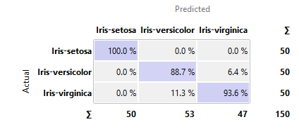
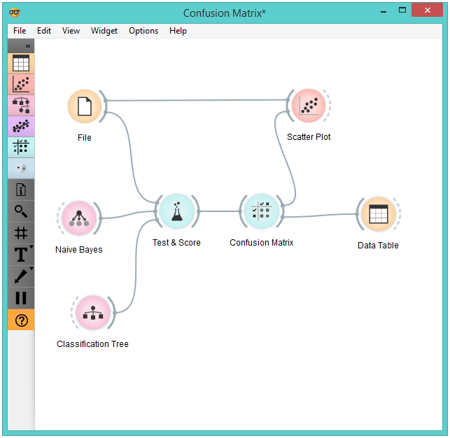

Confusion Matrix
================

Shows proportions between predicted and actual class.

Signals
-------

**Inputs**:

- **Evaluation results**

  Results of testing the algorithms; typically from **Test Learners**

**Outputs**:

- **Selected Data**

  Data subset from the selected cells in the confusion matrix.

Description
-----------

[**Confusion Matrix**](https://en.wikipedia.org/wiki/Confusion_matrix) gives the number/proportion of 
instances between predicted and actual class. Selection of
the elements in the matrix feeds the corresponding instances into the output
signal. This way, one can observe which specific instances were
misclassified and how.

The widget usually gets the evaluation results from **Test Learners**; an
example of the schema is shown below.

1. When evaluation results contain data on multiple learning
  algorithms, we have to choose one in the *Learners* box.
  
  Snapshot shows the confusion matrix for **Classification
  Tree** and **Naive Bayesian** classifier trained and tested on the *Iris* data.
  The righthand side of the widget contains the matrix for naive Bayesian
  classifier (since this classifier is selected on the left). Each row
  corresponds to a correct class, while columns represent the predicted
  classes. For instance, four instances of *Iris-versicolor* were
  misclassified as *Iris-virginica*. The rightmost column gives the number
  of instances from each class (there are 50 irises of each of the three
  classes) and the bottom row gives the number of instances classified into
  each class (e.g., 48 instances were classified into virginica).

2. In *Show* we select what data we would like to see in the matrix.

    - **Number of instances** shows correctly and incorrectly classified instances numerically.
    - **Proportions of predicted** shows how many instances
    classified as, say, *Iris-versicolor* are in which true class; in the
    table we can read the 0% of them are actually setosae, 88.5% of those
    classified as versicolor are versicolors, and 7.7% are virginicae.
    - **Proportions of actual** shows the opposite relation: of all true
    versicolors, 92% were classified as versicolors and 8% as virginicae.

  

3. In *Select* you can choose the desired output.

    - **Correct** sends all correctly classified instances to the output by
    selecting the diagonal of the matrix.
    - **Misclassified** selects the
    misclassified instances.
    - **None** annuls the selection.
  
  As mentioned before, one can also select individual cells of the table to select
  specific kinds of misclassified instances (e.g. the versicolors
  classified as virginicae).

4. When sending selected instances the widget can add new attributes,
  such as predicted classes or their probabilities, if the
  corresponding options *Predictions* and/or *Probabilities* are checked.

5. The widget outputs every change if *Auto send is on*. If not, the user will need to click *Send data* to commit the
  changes.

Example
-------

The following schema demonstrates well what this widget can be used for.

**Test Learners** gets the data from **File** and two learning algorithms from
**Naive Bayes** and **Classification Tree**. It performs cross-validation or
some other train-and-test procedures to get class predictions by both
algorithms for all (or some) data instances. Test results are fed into the **Confusion Matrix**, where we
can observe how many instances were misclassified and in which way.

In the output used **Data Table** to show the
instances we selected in the confusion matrix. If we, for instance, click
*Misclassified*, the table will contain all instances which were
misclassified by the selected method.

**Scatterplot** gets two sets of data. From the **File** widget it gets the
complete data, while the confusion matrix sends only the selected data,
misclassifications for instance. The scatter plot will show all
the data, with the bold symbols representing the selected data.

