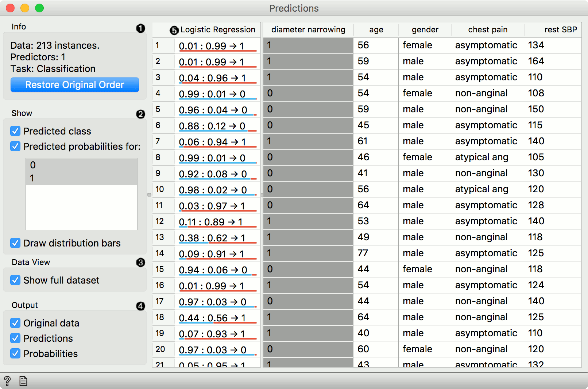
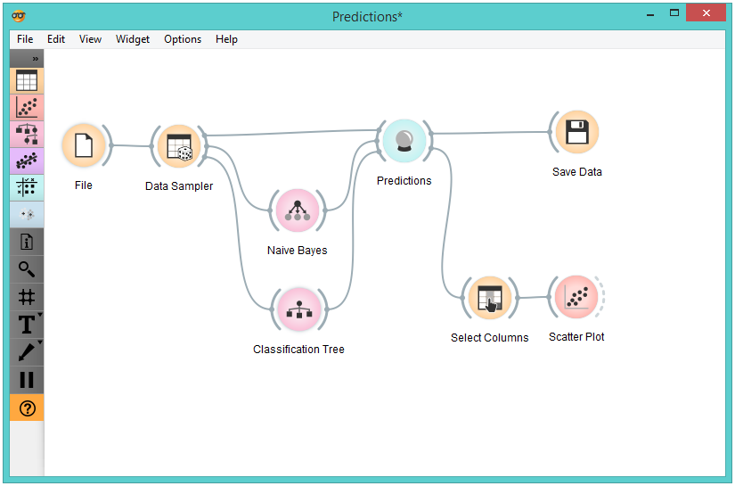
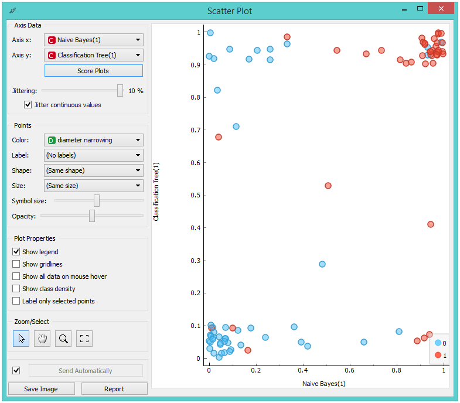
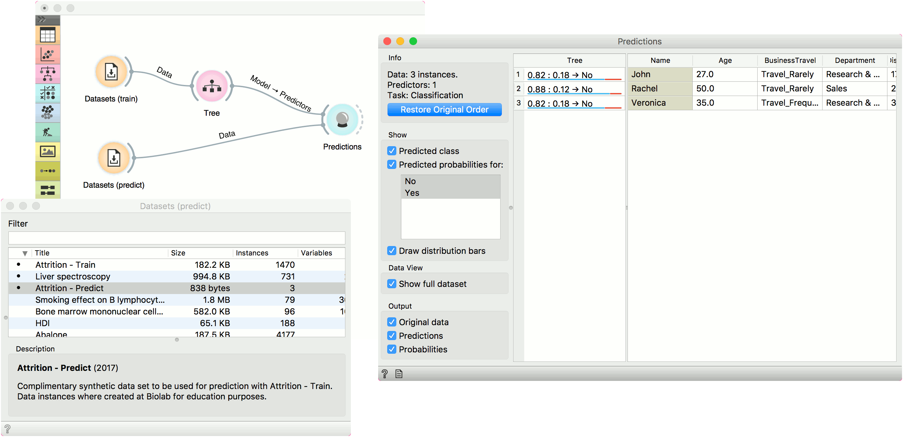

Predictions
===========

Shows models' predictions on the data.

Inputs
    Data
        input dataset
    Predictors
        predictors to be used on the data

Outputs
    Predictions
        data with added predictions
    Evaluation Results
        results of testing classification algorithms

The widget receives a dataset and one or more predictors (classifiers,
not learning algorithms - see the example below). It outputs the data
and the predictions.

1. Information on the input
2. The user can select the options for classification. If *Show predicted class* is ticked, the appended data table provides information on predicted class. If *Show predicted probabilities* is ticked, the appended data table provides information on probabilities predicted by the classifiers. The user can also select the predicted class he or she wants displayed in the appended data table. The option *Draw distribution bars* provides a nice visualization of the predictions. 
3. By ticking the *Show full dataset*, the user can append the entire data table to the *Predictions* widget. 
4. Select the desired output.
5. The appended data table
6. Produce a report.

Despite its simplicity, the widget allows for quite an interesting
analysis of decisions of `predictive models <https://en.wikipedia.org/wiki/Predictive_modelling>`_; there is
a simple demonstration at the bottom of the page. :doc:`Confusion Matrix <../evaluation/confusionmatrix>`
is a related widget and although many things can be done with any of
them, there are tasks for which one of them might be much more
convenient than the other.
The output of the widget is another dataset, where predictions are
appended as new meta attributes. You can select which features you wish
to output (original data, predictions, probabilities). The resulting dataset can be appended to the widget, but you can still choose to display it in a separate data table. 

Example
-------

We randomly split the *heart-disease* data into two subsets. The larger subset,
containing 70 % of data instances, is sent to :doc:`Naive Bayes <../model/naivebayes>` and
:doc:`Tree <../model/tree>`, so they can produce the corresponding
model. Models are then sent into **Predictions**, among with
the remaining 30 % of the data. Predictions shows how these examples are
classified.

To save the predictions, we simply attach the :doc:`Save <../data/save>` widget to
**Predictions**. The final file is a data table and can be saved as in a
.tab or .tsv format.

Finally, we can analyze the models' predictions. For that, we first
take :doc:`Select Columns <../data/selectcolumns>` with which we move the meta attributes with
probability predictions to features. The transformed data is then given
to the :doc:`Scatterplot <../visualize/scatterplot>`, which we set to use the attributes with
probabilities as the x and y axes, while the class is (already by
default) used to color the data points.

To get the above plot, we selected *Jitter continuous values*, since the
decision tree gives just a few distinct probabilities. The blue
points in the bottom left corner represent the people with no diameter
narrowing, which were correctly classified by both models. The
upper right red points represent the patients with narrowed vessels,
which were correctly classified by both.

Note that this analysis is done on a rather small sample, so these
conclusions may be ungrounded. Here is the entire workflow:

Another example of using this widget is given in the documentation for the
widget :doc:`Confusion Matrix <../evaluation/confusionmatrix>`.
