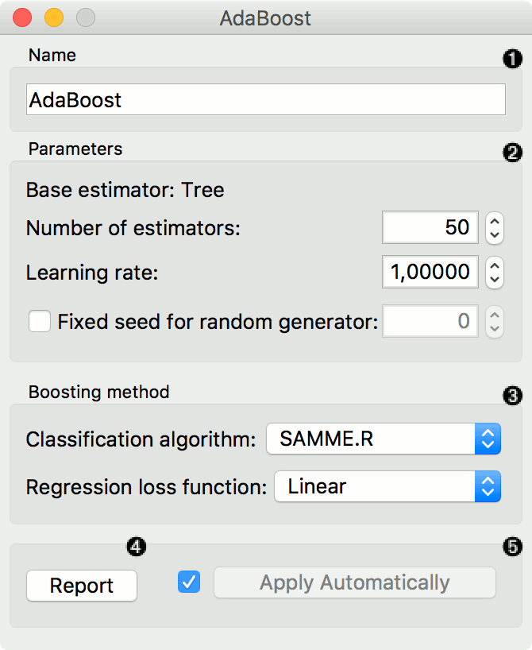
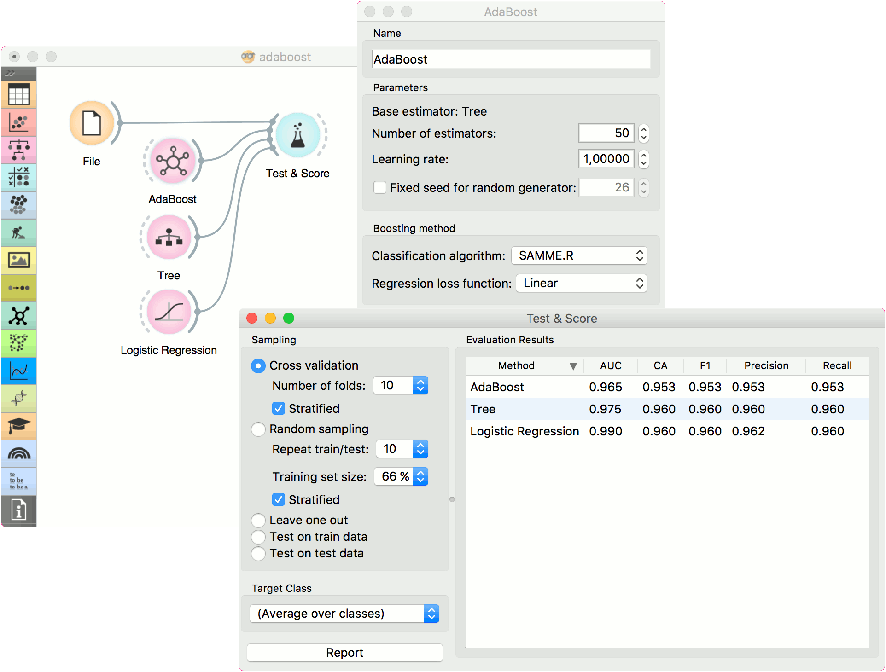
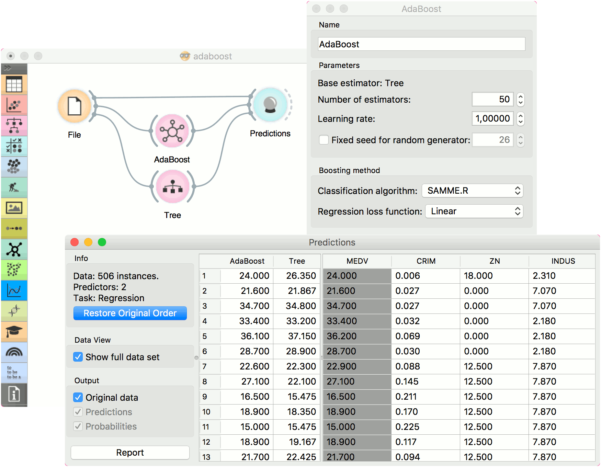

AdaBoost
========

An ensemble meta-algorithm that combines weak learners and adapts to the 'hardness' of each training sample.

**Inputs**

- Data: input dataset
- Preprocessor: preprocessing method(s)
- Learner: learning algorithm

**Outputs**

- Learner: AdaBoost learning algorithm
- Model: trained model

The [AdaBoost](https://en.wikipedia.org/wiki/AdaBoost) (short for "Adaptive boosting") widget is a machine-learning algorithm, formulated by [Yoav Freund and Robert Schapire](https://cseweb.ucsd.edu/~yfreund/papers/IntroToBoosting.pdf). It can be used with other learning algorithms to boost their performance. It does so by tweaking the weak learners.

**AdaBoost** works for both classification and regression.

1. The learner can be given a name under which it will appear in other widgets. The default name is "AdaBoost".
2. Set the parameters. The base estimator is a tree and you can set:
   - *Number of estimators*
   - *Learning rate*: it determines to what extent the newly acquired information will override the old information (0 = the agent will not learn anything, 1 = the agent considers only the most recent information)
   - *Fixed seed for random generator*: set a fixed seed to enable reproducing the results.
3. Boosting method.
   - *Classification algorithm* (if classification on input): SAMME (updates base estimator's weights with classification results) or SAMME.R (updates base estimator's weight with probability estimates).
   - *Regression loss function* (if regression on input): Linear (), Square (), Exponential ().
4. Produce a report.
5. Click *Apply* after changing the settings. That will put the new learner in the output and, if the training examples are given, construct a new model and output it as well. To communicate changes automatically tick *Apply Automatically*.

Examples
--------

For classification, we loaded the *iris* dataset. We used *AdaBoost*, [Tree](../model/tree.md) and [Logistic Regression](../model/logisticregression.md) and evaluated the models' performance in [Test & Score](../evaluation/testandscore.md).

For regression, we loaded the *housing* dataset, sent the data instances to two different models (**AdaBoost** and [Tree](../model/tree.md)) and output them to the [Predictions](../evaluation/predictions.md) widget.

