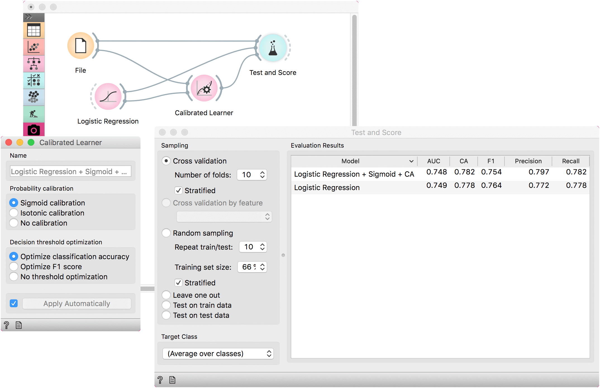

Calibrated Learner
==================

Wraps another learner with probability calibration and decision threshold optimization.

**Inputs**

- Data: input dataset
- Preprocessor: preprocessing method(s)
- Base Learner: learner to calibrate

**Outputs**

- Learner: calibrated learning algorithm
- Model: trained model using the calibrated learner

This learner produces a model that calibrates the distribution of class probabilities and optimizes decision threshold. The widget works only for binary classification tasks.

1. The name under which it will appear in other widgets. Default name is composed of the learner, calibration and optimization parameters.
2. Probability calibration:

   - [Sigmoid calibration](http://citeseer.ist.psu.edu/viewdoc/summary?doi=10.1.1.41.1639)
   - [Isotonic calibration](https://scikit-learn.org/stable/auto_examples/plot_isotonic_regression.html)
   - No calibration

3. Decision threshold optimization:

   - Optimize classification accuracy
   - Optimize F1 score
   - No threshold optimization

4. Press *Apply* to commit changes. If *Apply Automatically* is ticked, changes are committed automatically.

Example
-------

A simple example with **Calibrated Learner**. We are using the *titanic* data set as the widget requires binary class values (in this case they are 'survived' and 'not survived').

We will use [Logistic Regression](logisticregression.md) as the base learner which will we calibrate with the default settings, that is with sigmoid optimization of distribution values and by optimizing the CA.

Comparing the results with the uncalibrated **Logistic Regression** model we see that the calibrated model performs better.

