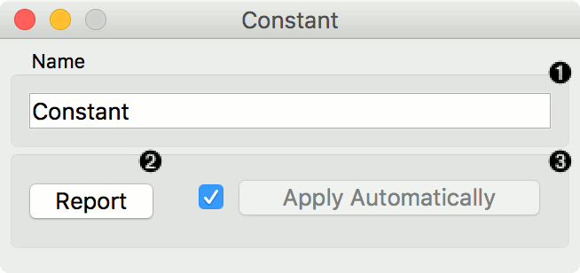
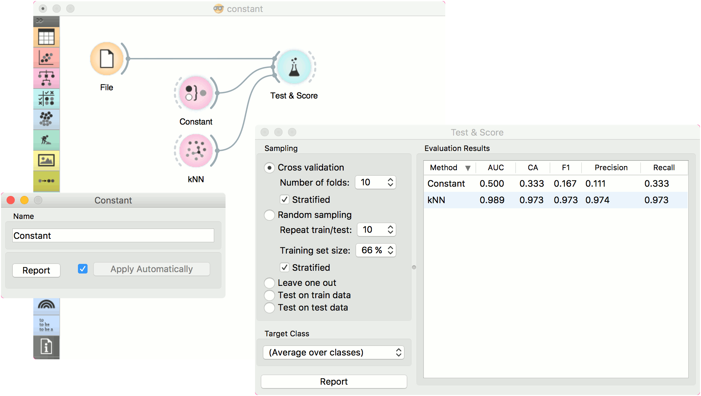
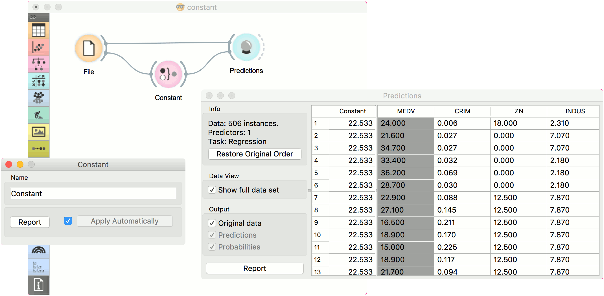

Constant
========

Predict the most frequent class or mean value from the training set.

Inputs
    Data
        input dataset
    Preprocessor
        preprocessing method(s)

Outputs
    Learner
        majority/mean learning algorithm
    Model
        trained model

This learner produces a model that always predicts the
`majority <https://en.wikipedia.org/wiki/Predictive_modelling#Majority_classifier>`_ for classification tasks and `mean value <https://en.wikipedia.org/wiki/Mean>`_ for regression tasks. 

For classification, when predicting the class value with :doc:`Predictions <../evaluation/predictions>`, the widget will return relative frequencies of the classes in the training set. When there are two or more majority classes, the classifier chooses the predicted class randomly, but always returns the same class for a particular example.

For regression, it *learns* the mean of the class variable and returns a predictor with the same mean value.

The widget is typically used as a baseline for other models.

This widget provides the user with two options:

1. The name under which it will appear in other widgets. Default name is "Constant".
2. Produce a report. 

If you change the widget's name, you need to click *Apply*. Alternatively, tick the box on the left side and changes will be communicated automatically. 

Examples
--------

In a typical classification example, we would use this widget to compare the scores of other learning algorithms (such as kNN) with the default scores. Use *iris* dataset and connect it to :doc:`Test & Score <../evaluation/testandscore>`. Then connect **Constant** and :doc:`kNN <../model/knn>` to :doc:`Test & Score <../evaluation/testandscore>` and observe how well :doc:`kNN <../model/knn>` performs against a constant baseline.

For regression, we use **Constant** to construct a predictor in :doc:`Predictions <../evaluation/predictions>`. We used the *housing* dataset. In **Predictions**, you can see that *Mean Learner* returns one (mean) value for all instances.

