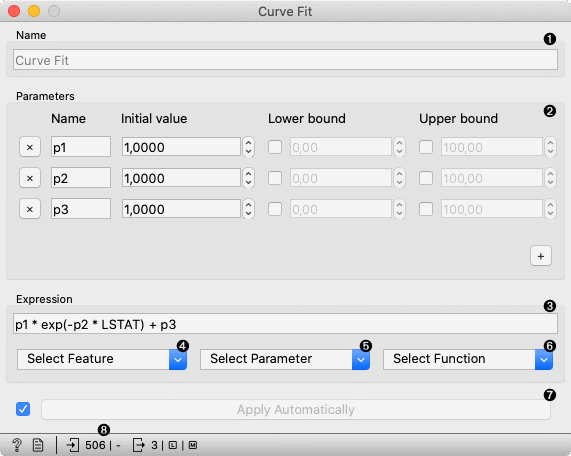
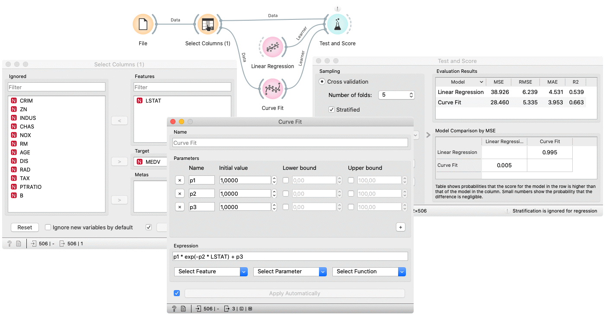

Curve Fit
=========

Fit a function to data.

**Inputs**

- Data: input dataset
- Preprocessor: preprocessing method(s)

**Outputs**

- Learner: curve fit learning algorithm
- Model: trained model
- Coefficients: fitted coefficients

The **Curve Fit** widget fits an arbitrary function to the input data. It only works for regression tasks.
The widget uses [scipy.curve_fit](https://docs.scipy.org/doc/scipy/reference/generated/scipy.optimize.curve_fit.html) to find the optimal values of the parameters.

The widget works only on regression tasks and only numerical features can be used for fitting.

1. The learner/predictor name.
2. Introduce model parameters.
3. Input an expression in Python. The expression should consist of at least one fitting parameter.
4. Select a feature to include into the expression. Only numerical features are available.
5. Select a parameter. Only the introduced parameters are available.
6. Select a function.
7. Press *Apply* to commit changes. If *Apply Automatically* is ticked, changes are committed automatically.
8. Show help, produce a report, input/output info.

Preprocessing
-------------

Curve fit uses default preprocessing when no other preprocessors are given. It executes them in the following order:

- removes instances with unknown target values
- removes empty columns
- imputes missing values with mean values

To remove default preprocessing, connect an empty [Preprocess](../data/preprocess.md) widget to the learner.

Example
-------

Below, is a simple workflow with *housing* dataset. Due to example simplicity we used only a single feature. Unlike the other modelling widgets, the Curve Fit needs data on the input. We trained **Curve Fit** and [Linear Regression](../model/linearregression.md) and evaluated their performance in [Test & Score](../evaluate/testandscore.md).

