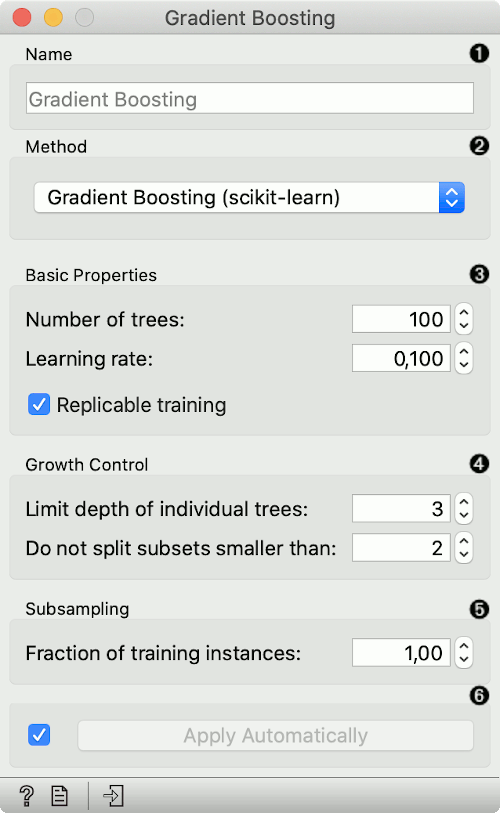
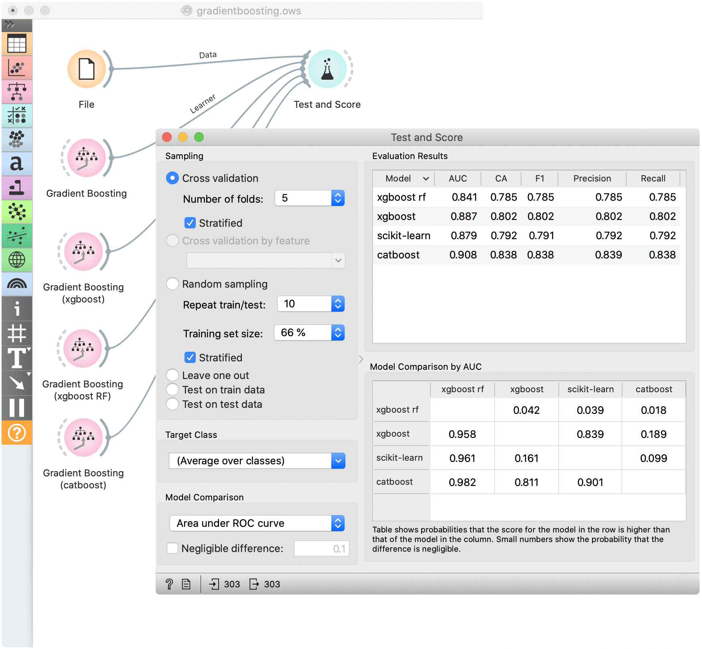

Gradient Boosting
=================

Predict using gradient boosting on decision trees.

**Inputs**

- Data: input dataset
- Preprocessor: preprocessing method(s)

**Outputs**

- Learner: gradient boosting learning algorithm
- Model: trained model

[Gradient Boosting](https://en.wikipedia.org/wiki/Gradient_boosting) is a machine learning technique for regression and classification problems, which produces a prediction model in the form of an ensemble of weak prediction models, typically decision trees.

1. Specify the name of the model. The default name is "Gradient Boosting".
2. Select a gradient boosting method:
   - [Gradient Boosting (scikit-learn)](https://scikit-learn.org/stable/modules/generated/sklearn.ensemble.GradientBoostingClassifier.html)
   - [Extreme Gradient Boosting (xgboost)](https://xgboost.readthedocs.io/en/latest/index.html)
   - [Extreme Gradient Boosting Random Forest (xgboost)](https://xgboost.readthedocs.io/en/latest/index.html)
   - [Gradient Boosting (catboost)](https://catboost.ai/docs/concepts/python-quickstart.html)
3. Basic properties:
   - *Number of trees*: Specify how many gradient boosted trees will be included. A large number usually results in better performance.
   - *Learning rate*: Specify the boosting learning rate. Learning rate shrinks the contribution of each tree.
   - *Replicable training*: Fix the random seed, which enables replicability of the results.
   - *Regularization*: Specify the L2 regularization term. Available only for *xgboost* and *catboost* methods.
4. Growth control:
   - *Limit depth of individual trees*: Specify the maximum depth of the individual tree.
   - *Do not split subsets smaller than*: Specify the smallest subset that can be split. Available only for *scikit-learn* methods.
5. Subsampling:
   - *Fraction of training instances*: Specify the percentage of the training instances for fitting the individual tree. Available for *scikit-learn* and *xgboost* methods.
   - *Fraction of features for each tree*: Specify the percentage of features to use when constructing each tree. Available for *xgboost* and *catboost* methods.
   - *Fraction of features for each level*: Specify the percentage of features to use for each level. Available only for *xgboost* methods.
   - *Fraction of features for each split*: Specify the percentage of features to use for each split. Available only for *xgboost* methods.
6. Click *Apply* to communicate the changes to other widgets. Alternatively, tick the box on the left side of the *Apply* button and changes will be communicated automatically.

Preprocessing
-------------

Gradient Boosting uses default preprocessing when no other preprocessors are given. It executes them in the following order:

- removes instances with unknown target values
- continuizes categorical variables (with one-hot-encoding)
- removes empty columns
- imputes missing values with mean values

To remove default preprocessing, connect an empty [Preprocess](../data/preprocess.md) widget to the learner.

Feature Scoring
---------------

Gradient Boosting can be used with Rank for feature scoring. See [Learners as Scorers](../../learners-as-scorers/index.md) for an example.

Example
-------

For a classification tasks, we use the *heart disease* data. Here, we compare all available methods in the [Test & Score](../evaluate/testandscore.md) widget.

