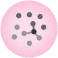
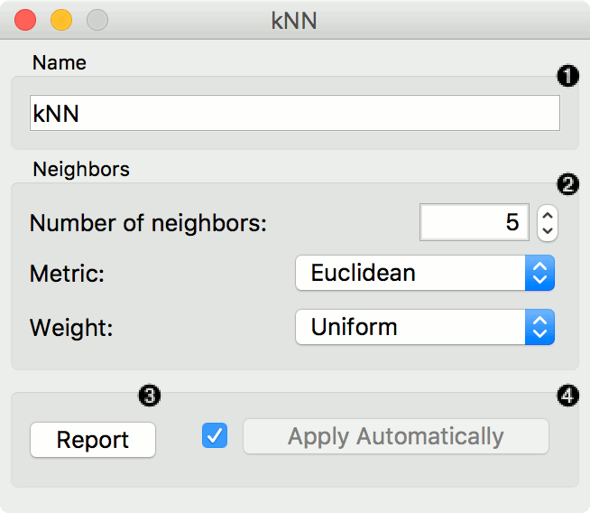
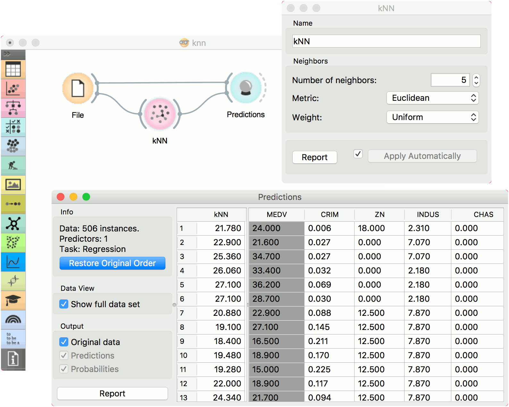

kNN
===

Predict according to the nearest training instances.

Signals
-------

**Inputs**:

-  **Data**

   A data set

-  **Preprocessor**

   Preprocessing method(s)

**Outputs**:

-  **Learner**

   A kNN learning algorithm with settings as specified in the dialog.

-  **Model**

   A trained model. Output signal sent only if input *Data* is present.

Description
-----------

The **kNN** widget uses the `kNN algorithm <https://en.wikipedia.org/wiki/K-nearest_neighbors_algorithm>`_ that searches for k closest training examples in feature space and uses their average as prediction.

1. A name under which it will appear in other widgets. The default name is
   "kNN".
2. Set the number of nearest neighbors, the distance parameter
   (metric) and weights as model criteria. Metric can be:

   -  `Euclidean <https://en.wikipedia.org/wiki/Euclidean_distance>`_
      ("straight line", distance between two points)
   -  `Manhattan <https://en.wikipedia.org/wiki/Taxicab_geometry>`_
      (sum of absolute differences of all attributes)
   -  `Maximal <https://en.wikipedia.org/wiki/Chebyshev_distance>`_
      (greatest of absolute differences between attributes)
   -  `Mahalanobis <https://en.wikipedia.org/wiki/Mahalanobis_distance>`_
      (distance between point and distribution).

   The *Weights* you can use are:

   -  **Uniform**: all points in each neighborhood are weighted equally. 
   -  **Distance**: closer neighbors of a query point have a greater influence than the neighbors further away.

3. Produce a report. 
4. When you change one or more settings, you need to click *Apply*, which will put a new learner on the output and, if the training examples are given, construct a new model and output it as well. Changes can also be applied automatically by clicking the box on the left side of the *Apply* button. 

Examples
--------

The first example is a classification task on *iris* data set. We compare the results of `k-Nearest neighbors <https://en.wikipedia.org/wiki/K-nearest_neighbors_algorithm>`_ with the default model :doc:`Constant <../model/constant>`, which always predicts the majority class.

.. figure:: images/Constant-classification.png

The second example is a regression task. This workflow shows how to use the *Learner* output. For the purpose of this example, we used the *housing* data set. We input the **kNN** prediction model into :doc:`Predictions <../evaluation/predictions>` and observe the predicted values.

