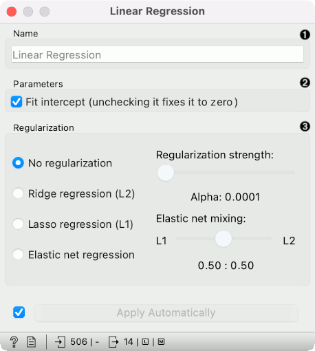
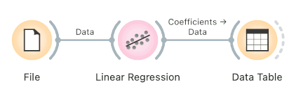
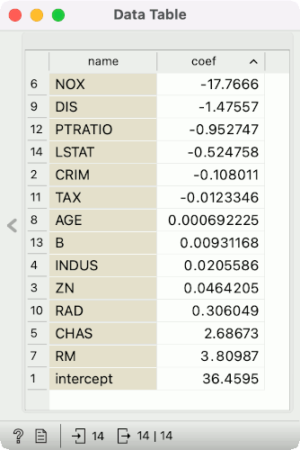

Linear Regression
=================

A linear regression algorithm with optional L1 (LASSO), L2 (ridge) or L1L2 (elastic net) regularization.

**Inputs**

- Data: input dataset
- Preprocessor: preprocessing method(s)

**Outputs**

- Learner: linear regression learning algorithm
- Model: trained model
- Coefficients: linear regression coefficients

The **Linear Regression** widget constructs a learner/predictor that learns a [linear function](https://en.wikipedia.org/wiki/Linear_regression) from its input data. The model can identify the relationship between a predictor xi and the response variable y. Additionally, [Lasso](https://en.wikipedia.org/wiki/Least_squares#Lasso_method) and [Ridge](https://en.wikipedia.org/wiki/Least_squares#Lasso_method) regularization parameters can be specified. Lasso regression minimizes a penalized version of the least squares loss function with L1-norm penalty and Ridge regularization with L2-norm penalty.

Linear regression works only on regression tasks.

1. The learner/predictor name
2. Parameters: Fit intercept. Unchecking the option forces the intercept to zero.
3. Choose a model to train:
   - no regularization
   - a [Ridge](https://en.wikipedia.org/wiki/Least_squares#Lasso_method) regularization (L2-norm penalty)
   - a [Lasso](https://en.wikipedia.org/wiki/Least_squares#Lasso_method) bound (L1-norm penalty)
   - an [Elastic net](https://en.wikipedia.org/wiki/Elastic_net_regularization) regularization

Preprocessing
-------------

Linear Regression uses default preprocessing when no other preprocessors are given. It executes them in the following order:

- removes instances with unknown target values
- continuizes categorical variables (with one-hot-encoding)
- removes empty columns
- imputes missing values with mean values

To remove default preprocessing, connect an empty [Preprocess](../data/preprocess.md) widget to the learner.

Feature Scoring
---------------

Linear Regression can be used with Rank for feature scoring. See [Learners as Scorers](../../learners-as-scorers/index.md) for an example.

Observing Coefficients
----------------------

To observe coefficients of linear regression, first build a model, then pass the model to the [Data Table](../data/datatable.md). This will automatically connect the *Coefficients* output to the Data Table, where you can sort the table by coefficients and observe which variables positively and negatively correlate with the prediction.

Example
-------

Below, is a simple workflow with *housing* dataset. We trained **Linear Regression** and [Random Forest](../model/randomforest.md) and evaluated their performance in [Test & Score](../evaluate/testandscore.md).

