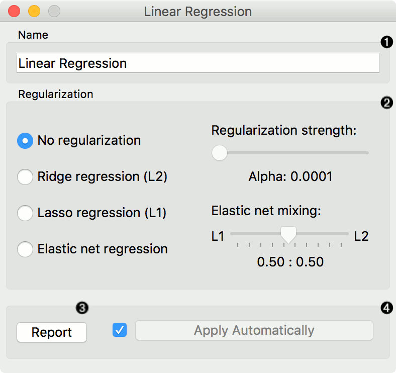
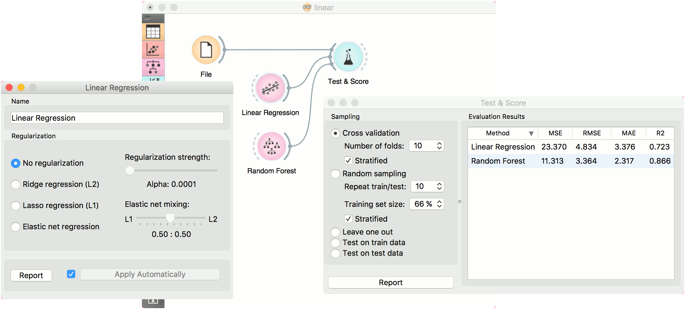

Linear Regression
=================

A linear regression algorithm with optional L1 (LASSO), L2 (ridge) or L1L2 (elastic net) regularization.

Inputs
    Data
        input dataset
    Preprocessor
        preprocessing method(s)

Outputs
    Learner
        linear regression learning algorithm
    Model
        trained model
    Coefficients
        linear regression coefficients

The **Linear Regression** widget constructs a learner/predictor that learns a `linear function <https://en.wikipedia.org/wiki/Linear_regression>`_ from its input data. The model can identify the relationship between a predictor xi and the response variable y. Additionally, `Lasso <https://en.wikipedia.org/wiki/Least_squares#Lasso_method>`_ and `Ridge <https://en.wikipedia.org/wiki/Least_squares#Lasso_method>`_ regularization parameters can be specified. Lasso regression minimizes a penalized version of the least squares loss function with L1-norm penalty and Ridge regularization with L2-norm penalty.

Linear regreesion works only on regression tasks.

1. The learner/predictor name
2. Choose a model to train:

   -  no regularization 
   -  a `Ridge <https://en.wikipedia.org/wiki/Least_squares#Lasso_method>`_
      regularization (L2-norm penalty)
   -  a `Lasso <https://en.wikipedia.org/wiki/Least_squares#Lasso_method>`_
      bound (L1-norm penalty)
   -  an `Elastic net <https://en.wikipedia.org/wiki/Elastic_net_regularization>`_
      regularization

3. Produce a report.
4. Press *Apply* to commit changes. If *Apply Automatically* is ticked, changes are committed automatically. 

Example
-------

Below, is a simple workflow with *housing* dataset. We trained **Linear Regression** and :doc:`Random Forest <../model/randomforest>` and evaluated their performance in :doc:`Test&Score <../evaluation/testandscore>`.

