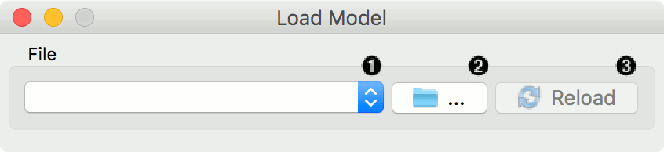
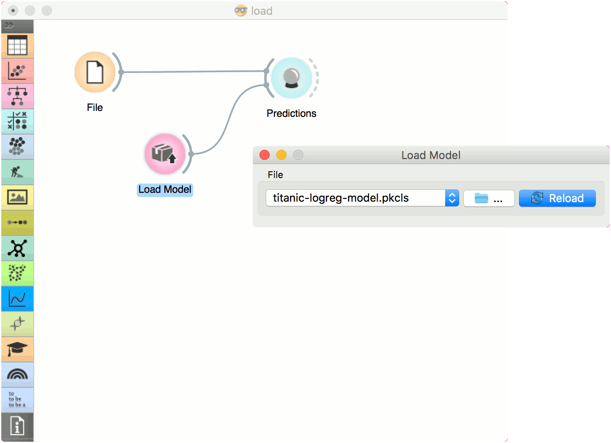

Load Model
==========

Load a model from an input file.

Outputs
    Model
        trained model

1. Choose from a list of previously used models.
2. Browse for saved models.
3. Reload the selected model.

Example
-------

When you want to use a custom-set model that you've saved before, open the **Load Model** widget and select the desired file with the *Browse* icon. This widget loads the exisiting model into :doc:`Predictions <../evaluation/predictions>` widget. Datasets used with **Load Model** have to contain compatible attributes!

