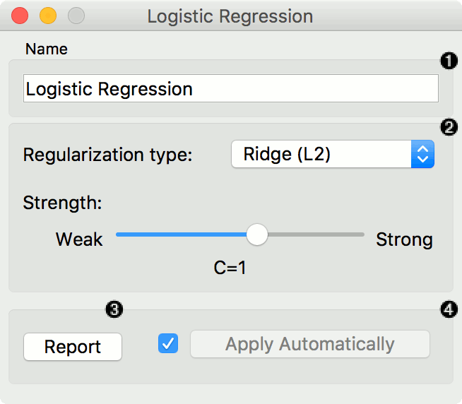
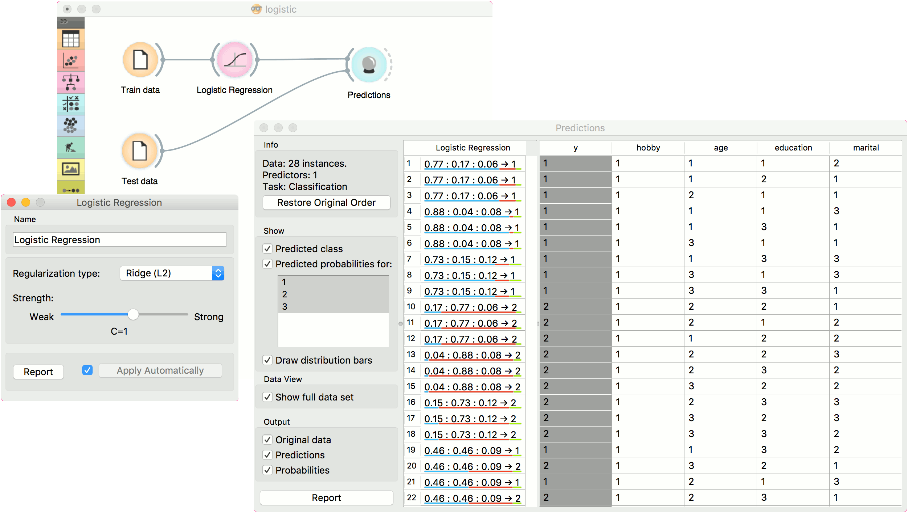

Logistic Regression
===================

The logistic regression classification algorithm with LASSO (L1) or ridge (L2) regularization.

Inputs
    Data
        input dataset
    Preprocessor
        preprocessing method(s)

Outputs
    Learner
        logistic regression learning algorithm
    Model
        trained model
    Coefficients
        logistic regression coefficients

**Logistic Regression** learns a `Logistic Regression <https://en.wikipedia.org/wiki/Logistic_regression>`_ model from the data.

It only works for classification tasks.

1. A name under which the learner appears in other widgets. The default
   name is "Logistic Regression".
2. `Regularization <https://en.wikipedia.org/wiki/Regularization_(mathematics)>`_
   type (either
   `L1 <https://en.wikipedia.org/wiki/Least_squares#Lasso_method>`_ or
   `L2 <https://en.wikipedia.org/wiki/Tikhonov_regularization>`_). Set
   the cost strength (default is C=1).
3. Press *Apply* to commit changes. If *Apply Automatically* is ticked, changes will be communicated automatically. 

Example
-------

The widget is used just as any other widget for inducing a classifier. This is an example demonstrating prediction results with logistic regression on the *hayes-roth* dataset. We first load *hayes-roth_learn* in the :doc:`File <../data/file>` widget and pass the data to **Logistic Regression**. Then we pass the trained model to :doc:`Predictions <../evaluation/predictions>`.

Now we want to predict class value on a new dataset. We load *hayes-roth_test* in the second **File** widget and connect it to **Predictions**. We can now observe class values predicted with **Logistic Regression** directly in **Predictions**.

