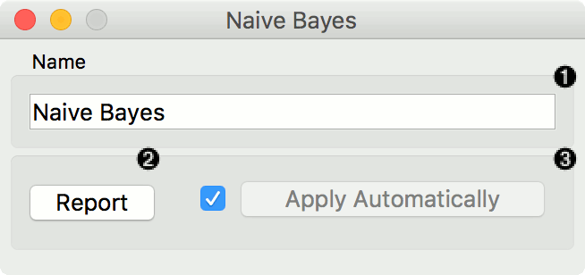
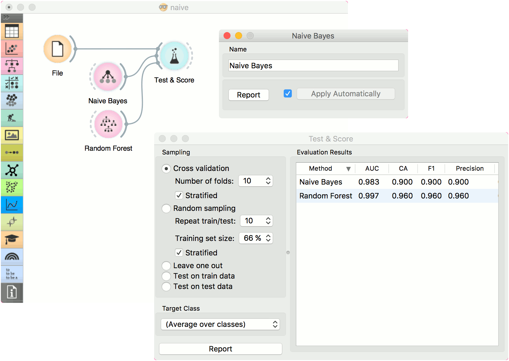
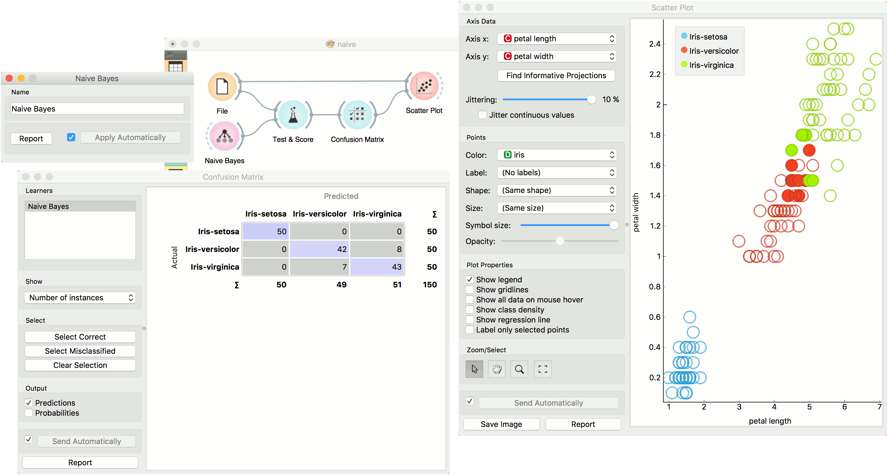

Naive Bayes
===========

.. figure:: icons/naive-bayes.png

A fast and simple probabilistic classifier based on Bayes' theorem with the assumption of feature independence.

Signals
-------

**Inputs**:

-  **Data**

   A data set

-  **Preprocessor**

   Preprocessing method(s)

**Outputs**:

-  **Learner**

   A naive bayes learning algorithm with settings as specified in the dialog.

-  **Model**

   A trained classifier. Output signal sent only if input *Data* is present.

Description
-----------

**Naive Bayes** learns a `Naive Bayesian <https://en.wikipedia.org/wiki/Naive_Bayes_classifier>`_ model from the data.

It only works for classification tasks.

This widget has two options: the name under which it will appear in
other widgets and producing a report. The default name is *Naive Bayes*. When you change it,
you need to press *Apply*.

Examples
--------

Here, we present two uses of this widget. First, we compare the results of the
**Naive Bayes** with another model, the :doc:`Random Forest <../model/randomforest>`. We connect *iris* data from :doc:`File <../data/file>` to :doc:`Test&Score <../evaluation/testandscore>`. We also connect **Naive Bayes** and :doc:`Random Forest <../model/randomforest>` to **Test & Score** and observe their prediction scores.

The second schema shows the quality of predictions made with **Naive Bayes**. We feed the :doc:`Test&Score <../evaluation/testandscore>` widget a Naive Bayes learner and then send the data to the :doc:`Confusion Matrix <../evaluation/confusionmatrix>`. We also connect :doc:`Scatterplot <../visualize/scatterplot>` with **File**. Then we select the misclassified instances in the **Confusion Matrix** and show feed them to :doc:`Scatterplot <../visualize/scatterplot>`. The bold dots in the scatterplot are the misclassified instances from **Naive Bayes**.

