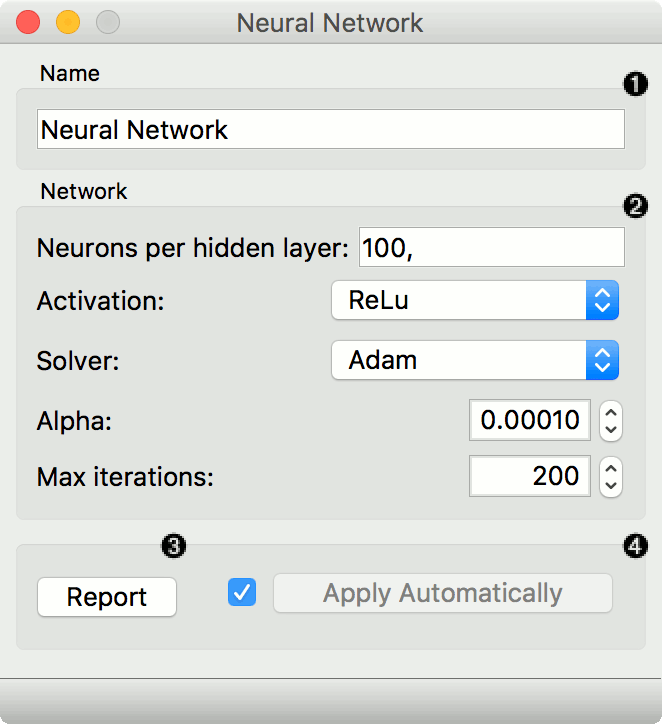
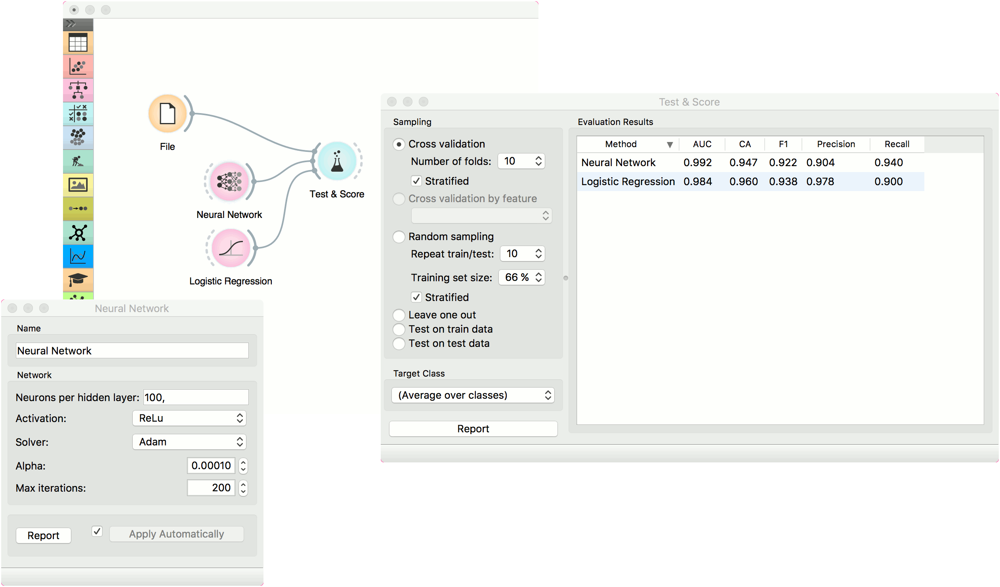
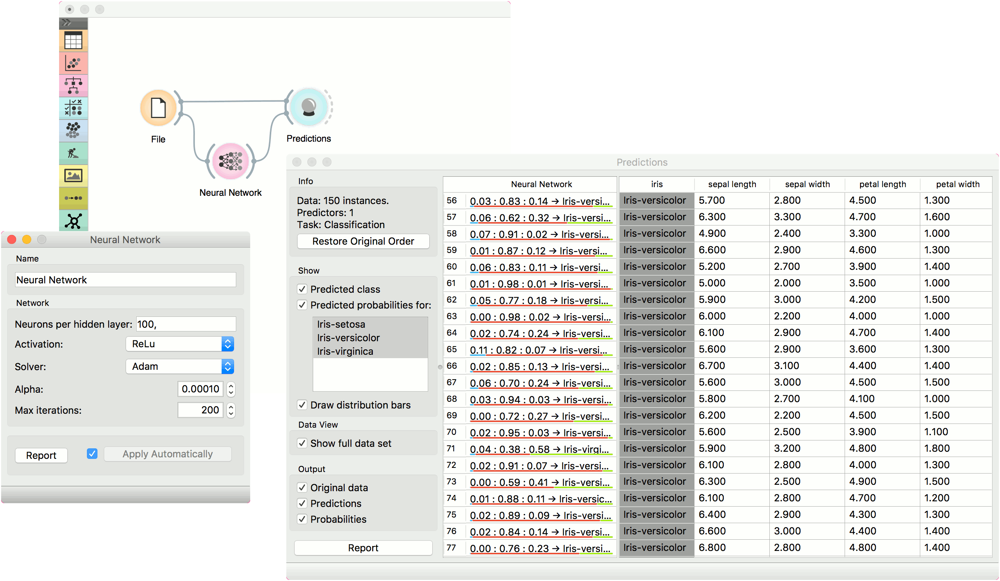

Neural Network
==============

.. figure:: icons/nn.png

A multi-layer perceptron (MLP) algorithm with backpropagation.

Signals
-------

**Inputs**:

-  **Data**

   A data set

-  **Preprocessor**

   Preprocessing method(s)

**Outputs**:

-  **Learner**

   A MLP learning algorithm with settings as specified in the dialog.

-  **Model**

   A trained model. Output signal sent only if input *Data* is present.

Description
-----------

The **Neural Network** widget uses sklearn's `Multi\-layer Perceptron algorithm <http://scikit-learn.org/stable/modules/neural_networks_supervised.html>`_ that can learn non-linear models as well as linear.

1. A name under which it will appear in other widgets. The default name is
   "Neural Network".
2. Set model parameters:
   -  Neurons per hidden layer: defined as the ith element represents the number of neurons in the ith hidden layer. E.g. a neural network with 3 layers can be defined as 2, 3, 2.
   -  Activation function for the hidden layer:
      -  Identity: no-op activation, useful to implement linear bottleneck
      -  Logistic: the logistic sigmoid function
      -  tanh: the hyperbolic tan function
      -  ReLu: the rectified linear unit function
   -  Solver for weight optimization:
      -  L-BFGS-B: an optimizer in the family of quasi-Newton methods
      -  SGD: stochastic gradient descent
      -  Adam: stochastic gradient-based optimizer
   -  Alpha: L2 penalty (regularization term) parameter
   -  Max iterations: maximum number of iterations

   Other parameters are set to `sklearn's defaults <http://scikit-learn.org/stable/modules/generated/sklearn.neural_network.MLPClassifier.html>`_.

3. Produce a report. 
4. When the box is ticked (*Apply Automatically*), the widget will
   communicate changes automatically. Alternatively, click *Apply*. 

Examples
--------

The first example is a classification task on *iris* data set. We compare the results of **Neural Network** with the :doc:`Logistic Regression <../model/logisticregression>`.

The second example is a prediction task, still using the *iris* data. This workflow shows how to use the *Learner* output. We input the **Neural Network** prediction model into :doc:`Predictions <../evaluation/predictions>` and observe the predicted values.

