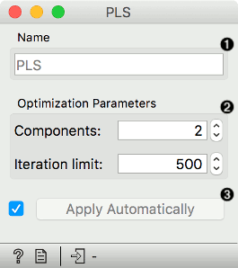
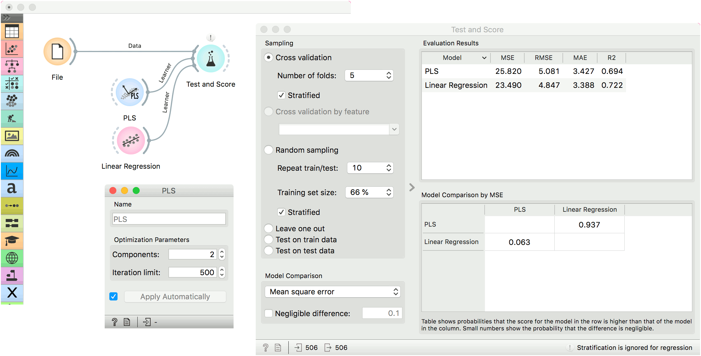

# PLS

Partial Least Squares Regression widget for multivariate data analysis.

**Inputs**

- Data: input dataset
- Preprocessor: preprocessing method(s)

**Outputs**

- Learner: PLS regression learning algorithm
- Model: trained model
- Coefficients: PLS regression coefficients

**PLS** (Partial Least Squares) widget acts as a regressor for data with numeric target variable. In its current implementation, it is the same as linear regression, but with a different kind of regularization. Here, regularization is performed with the choice of the components - the more components, the lesser the effect of regularization.

PLS widget can output coefficients, just like [Linear Regression](../model/linearregression.md). One can observe the effect of each variable in a [Data Table](../data/datatable.md).

1. The learner/predictor name
2. Parameters:
   - Components: the number of components of the model, which act as regularization (the more components, the lesser the regularization)
   - Iteration limit: maximum iterations for stopping the algorithm
3. Press *Apply* to commit changes. If *Apply Automatically* is ticked, changes are committed automatically.

Example
-------

Below, is a simple workflow with *housing* dataset. We trained **PLS** and [Linear Regression](../model/linearregression.md) and evaluated their performance in [Test & Score](../evaluate/testandscore.md).

