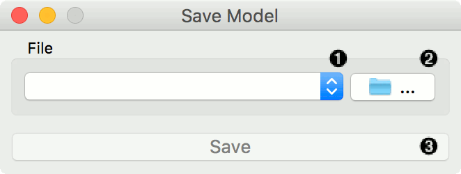
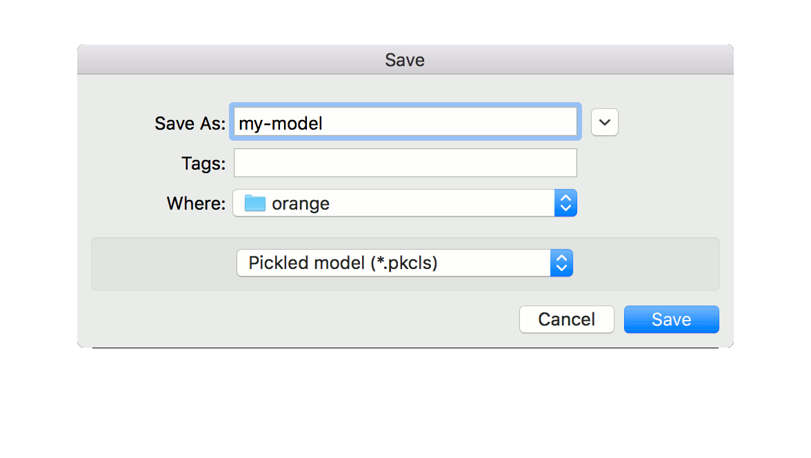
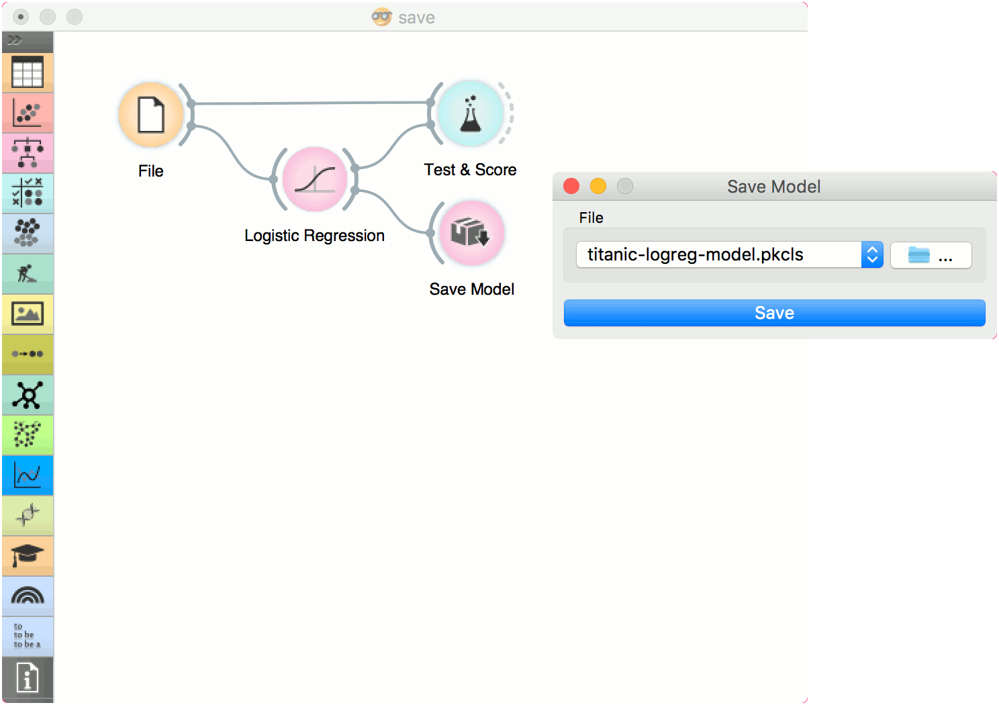

Save Model
==========

Save a trained model to an output file.

Inputs
    Model
        trained model

1. Choose from previously saved models.

2. Save the created model with the *Browse* icon. Click on the icon and enter
   the name of the file. The model will be saved to a pickled file. 

3. Save the model.

Example
-------

When you want to save a custom-set model, feed the data to the model (e.g. :doc:`Logistic Regression <../model/logisticregression>`) and connect it to **Save Model**. Name the model; load it later into workflows with :doc:`Load Model <../model/loadmodel>`. Datasets used with **Load Model** have to contain compatible attributes.

