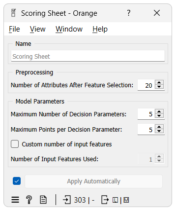
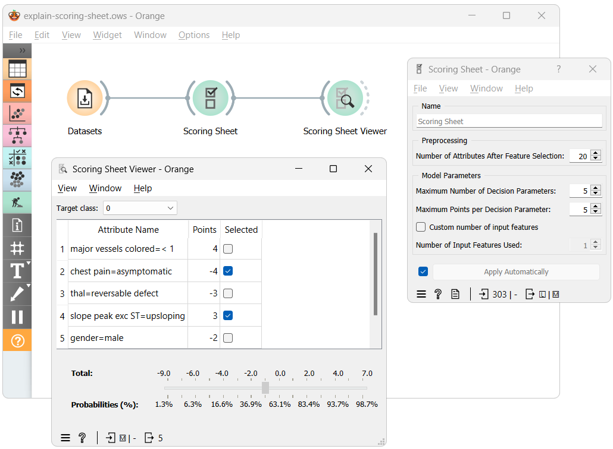
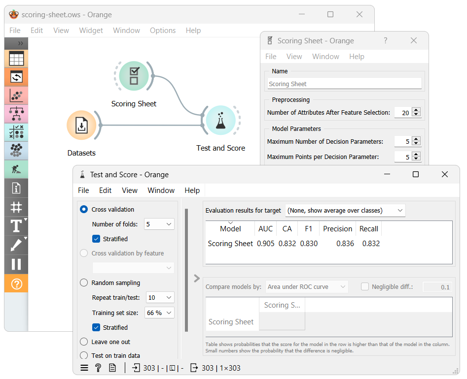

Scoring Sheet
================
A classification model for explainable predictions.

**Inputs**

- Data: dataset used to train the model
- Preprocessor: preprocessing methods

**Outputs**

- Learner: scoring sheet ([fasterrisk](https://github.com/jiachangliu/FasterRisk)) learning algorithm
- Model: a trained scoring sheet model

**Scoring Sheet** widget offers a machine learning model, which can be easily interpreted using the `Scoring Sheet Viewer` widget. The backbone of the widget is the <a href="https://github.com/jiachangliu/FasterRisk" target="_blank">fasterrisk</a> algorithm, for more information you can read the <a href="https://arxiv.org/abs/2210.05846" target="_blank">paper</a>.

The Scoring Sheet widget has four different parameters which we can tune to suit our needs:

- Number of Attributes After Feature Selection - This widget requires all features to be binary, resulting in a preprocessing pipeline that discretizes continuous features and one-hot encodes categorical ones. This parameter helps to manage (reduce) the potentially large number of resulting features and ensures a faster learning process by selecting only the best ones for model training.

- Maximum Number of Decision Parameters - Limits the number of decision parameters in the model, balancing complexity and explainability. More parameters can increase accuracy but make the model harder to explain.

- Maximum Points per Decision Parameter - Controls the range of points each decision parameter can contribute. A wider range can increase model complexity and accuracy but may reduce explainability.

- Number of Input Features Used - Specifies how many original features (before binarization) the decision parameters can originate from. This is useful for ensuring each parameter originates from a unique feature or when only a subset of features is desired.

Example
-------

The workflow above shows the most straightforward way of using the Scoring Sheet widget. After training the Scoring Sheet model using our dataset, we input it into the Scoring Sheet Viewer widget, which presents us with a scoring sheet. 

The second way of using the Scoring Sheet widget is to use it as any other classification model. In this case, we can use the Test & Score widget to evaluate the model's performance. In the evaluation results, we can see the model's performance for its predictions.