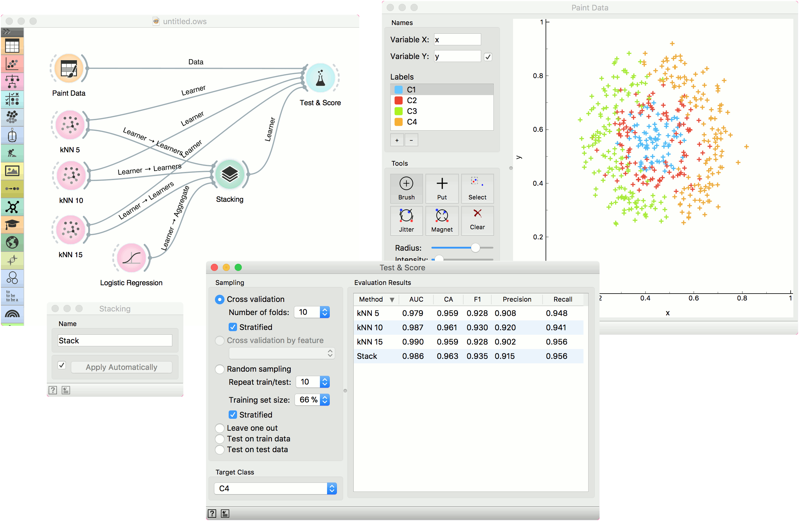

Stacking
========

Stack multiple models.

**Inputs**

- Data: input dataset
- Preprocessor: preprocessing method(s)
- Learners: learning algorithm
- Aggregate: model aggregation method

**Outputs**

- Learner: aggregated (stacked) learning algorithm
- Model: trained model

**Stacking** is an ensemble method that computes a meta model from several base models. The **Stacking** widget has the **Aggregate** input, which provides a method for aggregating the input models. If no aggregation input is given the default methods are used. Those are **Logistic Regression** for classification and **Ridge Regression** for regression problems.

1. The meta learner can be given a name under which it will appear in other widgets. The default name is “Stack”.
2. Click *Apply* to commit the aggregated model. That will put the new learner in the output and, if the training examples are given, construct a new model and output it as well. To communicate changes automatically tick *Apply Automatically*.
3. Access help and produce a report.

Example
-------

We will use [Paint Data](../data/paintdata.md) to demonstrate how the widget is used. We painted a complex dataset with 4 class labels and sent it to [Test & Score](../evaluate/testandscore.md). We also provided three [kNN](../model/knn.md) learners, each with a different parameters (number of neighbors is 5, 10 or 15). Evaluation results are good, but can we do better?

Let's use **Stacking**. **Stacking** requires several learners on the input and an aggregation method. In our case, this is [Logistic Regression](../model/logisticregression.md). A constructed meta learner is then sent to **Test & Score**. Results have improved, even if only marginally. **Stacking** normally works well on complex data sets.

