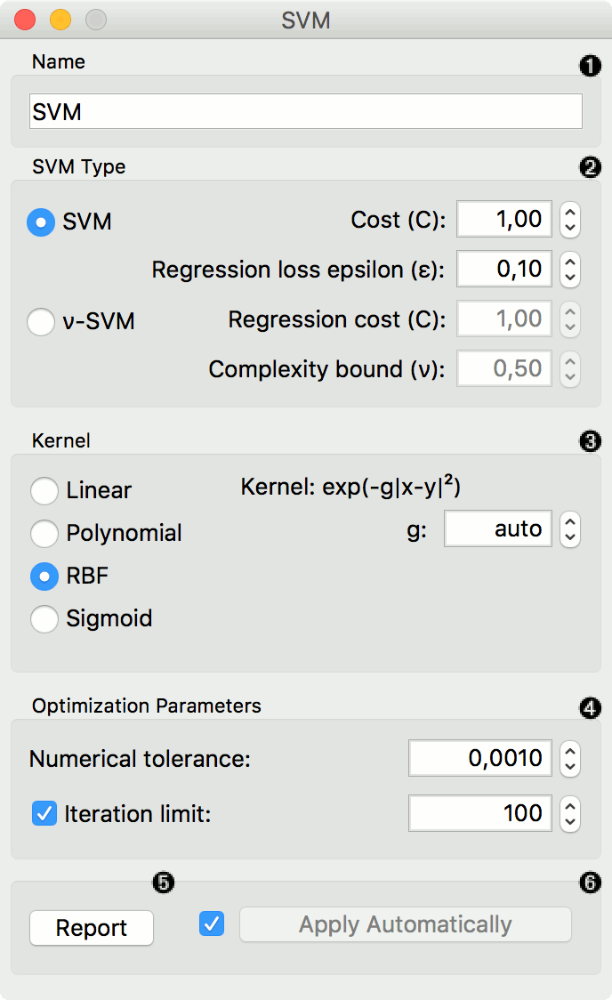
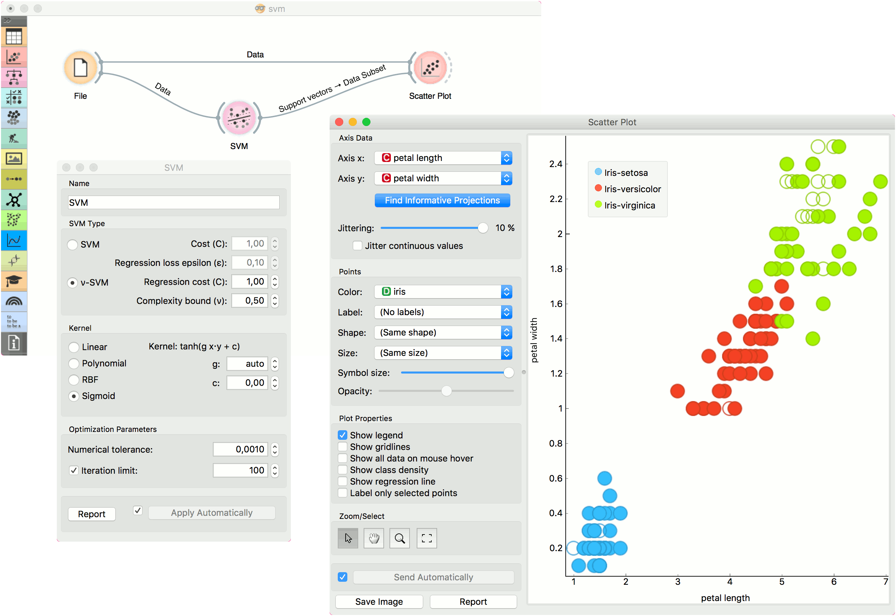

SVM
===

Support Vector Machines map inputs to higher-dimensional feature spaces.

Inputs
    Data
        input dataset
    Preprocessor
        preprocessing method(s)

Outputs
    Learner
        linear regression learning algorithm
    Model
        trained model
    Support Vectors
        instances used as support vectors

`Support vector machine <https://en.wikipedia.org/wiki/Support_vector_machine>`_ (SVM) is a machine learning technique that separates the attribute space with a hyperplane, thus maximizing the margin between the instances of different classes or class values. The technique often yields supreme predictive performance results. Orange embeds a popular implementation of SVM from the `LIBSVM <https://www.csie.ntu.edu.tw/~cjlin/libsvm/>`_ package. This widget is its graphical user interface.

For regression tasks, **SVM** performs linear regression in a high dimension feature space using an ε-insensitive loss. Its estimation accuracy depends on a good setting of C, ε and kernel parameters. The widget outputs class predictions based on a `SVM Regression <https://en.wikipedia.org/wiki/Support_vector_machine#Regression>`_.

The widget works for both classification and regression tasks.

1. The learner can be given a name under which it will appear in other widgets. The default name is "SVM".
2. SVM type with test error settings. *SVM* and *ν-SVM* are based on different minimization of the error function. On the right side, you can set test error bounds:

   - `SVM <http://scikit-learn.org/stable/modules/generated/sklearn.svm.SVR.html>`_:

      - `Cost <http://www.quora.com/What-are-C-and-gamma-with-regards-to-a-support-vector-machine>`_: penalty term for loss and applies for classification and regression tasks.
      - ε: a parameter to the epsilon-SVR model, applies to regression tasks. Defines the distance from true values within which no penalty is associated with predicted values.

   - `ν-SVM <http://scikit-learn.org/stable/modules/generated/sklearn.svm.NuSVR.html#sklearn.svm.NuSVR>`_:
      
      - `Cost <http://www.quora.com/What-are-C-and-gamma-with-regards-to-a-support-vector-machine>`_: penalty term for loss and applies only to regression tasks
      - ν: a parameter to the ν-SVR model, applies to classification and regression tasks. An upper bound on the fraction of training errors and a lower bound of the fraction of support vectors.

3. Kernel is a function that transforms attribute space to a new feature space to fit the maximum-margin hyperplane, thus allowing the algorithm to create the model with:

   -  `Linear <https://en.wikipedia.org/wiki/Linear_model>`_
   -  `Polynomial <https://en.wikipedia.org/wiki/Polynomial_kernel>`_
   -  `RBF <https://en.wikipedia.org/wiki/Radial_basis_function_kernel>`_ and
   -  `Sigmoid <http://crsouza.com/2010/03/kernel-functions-for-machine-learning-applications/#sigmoid>`_

   kernels. Functions that specify the kernel are presented upon selecting them, and the constants involved are:

   -  **g** for the gamma constant in kernel function (the recommended
      value is 1/k, where k is the number of the attributes, but since
      there may be no training set given to the widget the default is 0
      and the user has to set this option manually),
   -  **c** for the constant c0 in the kernel function (default 0), and
   -  **d** for the degree of the kernel (default 3).

4. Set permitted deviation from the expected value in *Numerical Tolerance*. Tick the box next to *Iteration Limit* to set the maximum number of iterations permitted.
5. Produce a report. 
6. Click *Apply* to commit changes. If you tick the box on the left side of the *Apply* button, changes will be communicated automatically. 

Examples
--------

In the first (regression) example, we have used *housing* dataset and split the data into two data subsets (*Data Sample* and *Remaining Data*) with :doc:`Data Sampler <../data/datasampler>`. The sample was sent to SVM which produced a *Model*, which was then used in :doc:`Predictions <../evaluation/predictions>` to predict the values in *Remaining Data*. A similar schema can be used if the data is already in two separate files; in this case, two :doc:`File <../data/file>` widgets would be used instead of the :doc:`File <../data/file>` - :doc:`Data Sampler <../data/datasampler>` combination.

.. figure:: images/SVM-predictions.png

The second example shows how to use **SVM** in combination with :doc:`Scatterplot <../visualize/scatterplot>`. The following workflow trains a SVM model on *iris* data and outputs support vectors, which are those data instances that were used as support vectors in the learning phase. We can observe which are these data instances in a scatter plot visualization. Note that for the workflow to work correctly, you must set the links between widgets as demonstrated in the screenshot below.

References
----------

`Introduction to SVM on StatSoft <http://www.statsoft.com/Textbook/Support-Vector-Machines>`_.
